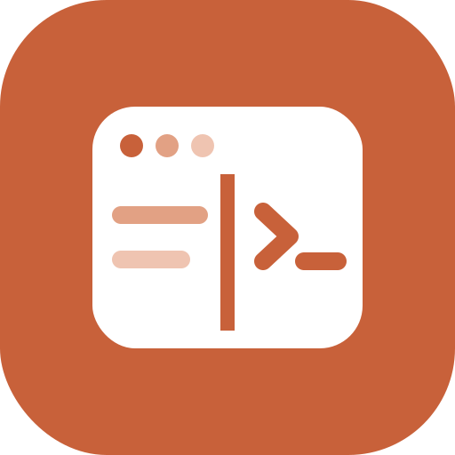
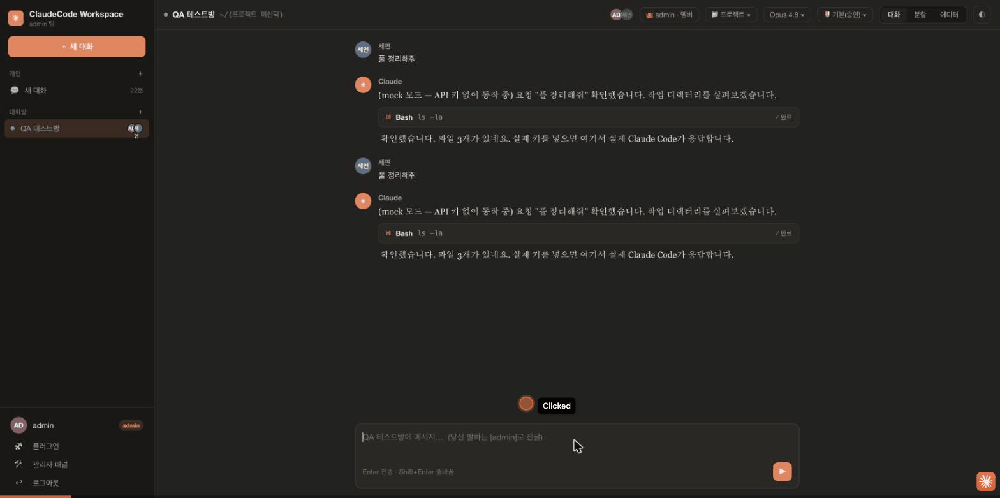
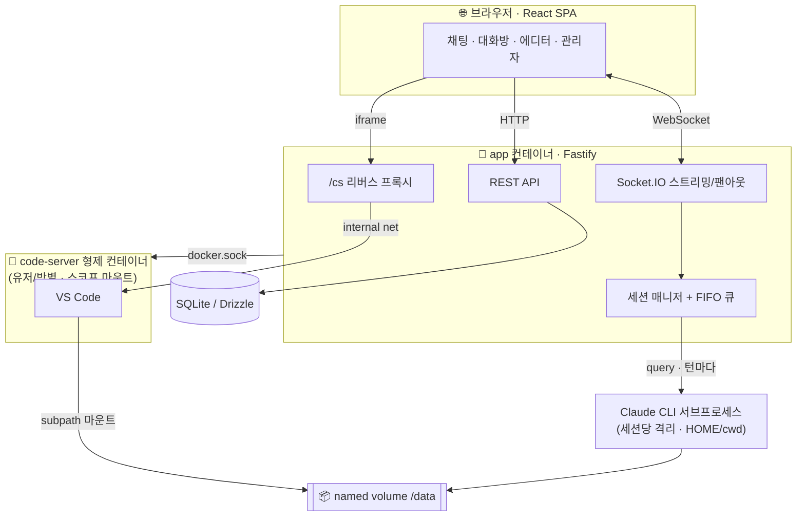

<div align="center">

[English](README.md) · **한국어**



# ClaudeCode Workspace

**서버 1대에 상주하는 Claude Code를, 팀 전체가 웹에서 함께 쓰는 워크스페이스.**

세션마다 격리된 Claude Code · 여러 명이 같이 쓰는 공유 대화방 · 브라우저 안의 VS Code까지 — 한 번의 `docker compose up`으로.


<br/>



<sub>로그인 → 대화방 → 메시지 전송 → 웹에서 툴 승인 → 툴 실행 → 분할 뷰로 브라우저 속 VS Code까지 (MOCK 모드 데모)</sub>

</div>

---

## 한눈에

Claude Code CLI는 강력하지만 **내 터미널 하나**에 묶여 있습니다. ClaudeCode Workspace는 그 CLI를 **서버에 올려 팀 자산으로** 바꿉니다.

- 각자 브라우저로 접속 → **자기만의 격리된 Claude Code 세션**
- 필요하면 **단체 대화방**에 모여 하나의 Claude를 같이 부린다 (단톡방처럼)
- 승인이 필요한 위험한 작업은 **웹에서 실시간 승인/거부**
- 그 자리에서 **VS Code(code-server)** 를 열어 편집·터미널·git까지
- 문서를 올리면 Claude가 컴파일해 주는 **LLM Wiki** 팀 지식 기반
- **유저별 Claude 토큰**으로 각자 실행(관리자 공통 토큰·env 폴백), 관리자는 **사용량 대시보드**로 전체 파악

> 개인 원격 셋업으로도 그대로 동작합니다 — 혼자라면 계정 1개짜리 "원격 Claude Code"가 됩니다.

---

## ✨ 강점

|  | 강점 | 설명 |
|---|---|---|
| 🧬 | **진짜 세션 격리** | "하나의 배포"지만 런타임은 세션마다 별도 프로세스. Agent SDK가 턴마다 `HOME`/`cwd`/plugins를 주입해 유저·방별로 완전히 분리 |
| 👥 | **공유 대화방 + 세밀한 위임** | 방장이 멤버별로 승인·중단·초대·추방·방장이양·방삭제 권한을 토글. FIFO 큐로 다자 대화 정렬, 발화자 프리픽스로 모델이 화자 인식 |
| 🛡 | **웹 권한 프롬프트** | Claude가 툴을 쓰기 직전 멈추고 브라우저에 허용/거부/항상. 격리 deny 펜스는 모드와 무관하게 항상 적용 |
| 🧑‍💻 | **브라우저 속 VS Code** | 프로젝트를 code-server 컨테이너로 즉시 배포. 자기 볼륨 + 공통만 마운트(격리), 유휴 시 자동 회수 |
| 🔌 | **2-클래스 플러그인** | 공통(관리자)·개인(유저) 티어. git·로컬 업로드 설치, 관리자 필수강제, 유저별 on/off. 플러그인별 상세 보기 + 원클릭 업데이트 |
| 🪪 | **유저별 Claude 토큰** | 멤버가 각자 토큰 등록(암호화 저장), 사용량·비용을 개인별로 귀속. 관리자 공통 토큰 → env 순으로 폴백 |
| 📚 | **LLM Wiki 지식 기반** | 문서/이미지 폴더를 올리면 Claude가 상호링크된 아티클로 컴파일, 유저는 읽기 전용 스레드로 질의. 이미 컴파일된 위키는 임포트로 컴파일 생략 |
| 🔑 | **키 없이도 완전 동작** | 토큰이 어디에도 없으면 **MOCK 모드**로 스트리밍·권한·툴카드 UX가 그대로 시연됨 → 평가·데모·CI에 최적 |
| 🐳 | **한 방 배포** | 멀티스테이지 단일 이미지 + `docker compose up`. code-server는 형제 컨테이너로 동적 spawn (오케스트레이터 불필요) |
| 🗂 | **대화 히스토리 접기** | `/clear`·`/compact` 시 위쪽 대화를 타임스탬프가 붙은 토글로 접어 쌓음 — 무한 스크롤 대신 한 번의 클릭으로 과거 대화 열람 |
| 🎨 | **데스크톱 앱 급 UI** | Claude Code 데스크톱을 따른 clay 테마, 라이트/다크, 접이식 툴카드, serif 응답, 멤버 아바타·presence |

---

## 🚀 빠른 시작

### 개발 모드

```bash
npm install
cp .env.example .env      # 키 넣으면 실제 Claude, 비우면 MOCK 모드
npm run dev               # server :3000  +  Vite :5173 (프록시)
```

→ http://localhost:5173 접속 · 초기 관리자 **admin / admin** (배포 후 꼭 변경)

### 프로덕션 (Docker)

```bash
cp .env.example .env      # SESSION_SECRET, ANTHROPIC_API_KEY 설정
docker compose up -d --build
```

→ http://localhost:3000 · 단일 이미지가 API·WebSocket·정적 SPA·code-server 프록시를 모두 서빙

> **요구사항:** code-server 편집기는 Docker 배포에서만 동작하며, 볼륨 subpath 마운트를 위해 **Docker Engine ≥ 26**이 필요합니다.

---

## 🧭 아키텍처



**동작 원리 (핵심 4가지)**

1. **세션 = 서브프로세스** — Agent SDK `query()`가 세션마다 Claude CLI를 spawn. `env.HOME`으로 개인/방 설정이 자연 해석되고, 공통 플러그인·MCP·agents는 명시 주입됩니다.
2. **공유 대화방 = 장기 단일 세션** — resume로 컨텍스트를 이어가고, FIFO 큐가 여러 멤버의 발화를 순서대로 처리, 결과는 전원에게 WebSocket 팬아웃.
3. **권한 = `canUseTool` 브리지** — 콜백이 멈추면 승인권자(방장/위임자)의 웹 응답을 기다립니다. 경로 이탈 툴은 정책상 항상 차단.
4. **에디터 = 형제 컨테이너** — 앱이 도커 소켓으로 code-server를 띄우고, 자기 볼륨 subpath + 공통만 마운트한 뒤 인앱 프록시로만 노출(포트 미개방).

---

## 🧩 기능 자세히

<details>
<summary><b>공유 대화방 & 권한 위임</b></summary>

- 방 = 워크스페이스 엔티티(자체 `HOME`·프로젝트), 개인 세션과 평행 구조
- 방장 기본 승인권 → 멤버 목록에서 권한별 토글로 위임
- **위임 가능:** 승인 · 중단 · 초대 · 추방 · 방장이양 · 방삭제
- **방장 전용(위임 불가):** 방 권한모드 변경
- 대기 중 메시지 취소, 실행 중 턴 인터럽트, presence 표시
</details>

<details>
<summary><b>권한 모델 (2-클래스 오버라이드)</b></summary>

- **클래스 1 (잠금):** 타 유저 경로·`~/.claude`·키 경로 차단, `additionalDirectories` 펜스, 권한모드 천장 — 모드 무관 항상 강제
- **클래스 2 (편의):** 공통 플러그인·MCP·agents — 기본 ON, 유저가 자기 세션서 끄기/개인 것 추가 가능(이름 충돌 시 개인 우선)
- 모드: 기본(승인) · 편집 자동승인 · 전체 허용 · 플랜, 관리자가 bypass 상한 지정
</details>

<details>
<summary><b>code-server 통합</b></summary>

- on-demand spawn + 유휴 reaper(기본 30분) + 로그아웃 시 제거 + 부팅 시 고아 정리
- 라우팅 `/cs/<uid>/<projectId>/<난수토큰>` — 타인 접근 차단, code-server auth는 프록시에 위임
- 공용 API 키는 백엔드에만 → 편집기 터미널에서 키 조회 불가
</details>

<details>
<summary><b>플러그인 관리</b></summary>

- 공통 티어 = 관리자 전용(마켓플레이스 등록·git/로컬 업로드·필수강제)
- 개인 티어 = 유저 자유(마켓 추가·설치·공통 클래스2 on/off)
- 플러그인별 상세 보기(매니페스트·스킬·파일트리) + git 플러그인 원클릭 업데이트
</details>

<details>
<summary><b>유저별 Claude 토큰</b></summary>

- 유저가 개인 Claude 토큰(`sk-ant-oat…` / `sk-ant-api…`) 등록, 암호화 저장 · 미등록자에겐 로그인 시 알림
- 턴 우선순위: 유저 개인 토큰 → 관리자 공통 토큰 → env 키 → MOCK
- 공유 대화방에선 각 발화자의 턴이 그 사람 토큰으로 실행, 사용량은 개인별 집계(관리자 대시보드)
</details>

<details>
<summary><b>LLM Wiki (팀 지식 기반)</b></summary>

- 관리자가 문서/이미지 폴더를 업로드 → Claude가 `raw/` 소스를 읽어 `wiki/` 아티클 + `_index.md`로 **자동 컴파일**(멀티모달, 이미지 전사 포함)
- **이미 컴파일된 위키 임포트:** 주제 생성 시 "이미 컴파일된 위키" 옵션 → 컴파일 생략, 완성본을 그대로 사용(주제 export 재활용)
- 사용자는 각자 **개인 스레드**에서 위키 범위 내 읽기 전용 질의, 파일 탐색기로 raw/wiki 열람
</details>

<details>
<summary><b>다국어 UI (한국어 / English)</b></summary>

- 사이드바 상단 토글로 즉시 전환, `localStorage` 저장 + 브라우저 언어 자동 감지
- 사전 1곳(`web/src/lib/i18n.ts`)에서 관리, 신규 UI 문자열은 항상 i18n 처리
</details>

---

## ⚙️ 설정 (.env)

| 변수 | 설명 | 기본 |
|---|---|---|
| `ANTHROPIC_API_KEY` | env 레벨 공유 폴백 토큰(유저별·관리자 공통 토큰이 우선). 어디에도 없으면 MOCK 모드 | — |
| `SESSION_SECRET` | 쿠키 서명 시크릿 (**반드시 변경**) | — |
| `MAX_CONCURRENT_TURNS` | 공용키 전역 동시 턴 캡 + 초과 큐잉 + 429 백오프 | `3` |
| `BOOTSTRAP_ADMIN_USER` / `_PASSWORD` | 최초 부팅 admin(유저 0명일 때만) | `admin` |
| `CODE_SERVER_IMAGE` | 편집기 이미지 | `codercom/code-server:latest` |
| `CODE_SERVER_IDLE_MS` | 유휴 컨테이너 회수 시간 | `1800000` |

---

## 🗂 구조

```
server/                Fastify · Socket.IO · Agent SDK · SQLite/Drizzle · dockerode
  src/claude/          세션 매니저 · config 레이어링 · 권한 브리지 · 스로틀
  src/rooms/           방 매니저(위임) · FIFO 큐
  src/codeserver/      spawn/reap · /cs 프록시(http+ws)
  src/wiki/            LLM Wiki 컴파일 (raw/ 소스 → wiki/ 아티클)
  src/auth/            로그인 · 유저별/공통 Claude 토큰 해석
  src/usage/           유저별 토큰·비용 트래킹
  src/routes/          sessions · rooms · projects · plugins · wiki · admin
web/                   React · Vite · Tailwind · Radix · zustand
  src/lib/i18n.ts      ko/en 사전 + 언어 전환
DESIGN.md              확정 설계 스펙 (19개 결정)
Dockerfile · docker-compose.yml
```

---

## 🔐 보안 posture

상호 신뢰하는 팀/개인을 전제로 한 **경량 posture**입니다. 앱 로그인 + revocable 세션 쿠키로 접근을 막고, 에이전트 파일 접근은 소프트 펜스, 사람의 편집기 터미널은 컨테이너 하드 격리 + 공용키 미노출로 분리합니다. 도커 소켓 마운트는 앱에 호스트 root급 권한을 주므로, **무신뢰 멀티테넌트 SaaS 용도가 아닙니다.** 인증 어댑터 자리를 남겨 SSO/프록시 헤더로 확장 가능합니다.

---

## 🛣 로드맵

- [x] 유저별 Claude 토큰 (개인 + 관리자 공통 + env 폴백)
- [ ] SSO / 프록시 헤더 인증 어댑터
- [ ] Postgres · Redis 승격 (멀티프로세스 스케일)
- [ ] CRDT 실시간 협업 편집

---

## 🤝 기여 · 라이선스

이슈/PR 환영합니다. 커밋은 기능 단위(`feat`/`fix`/`chore`)로 유지합니다.
[MIT License](LICENSE).

<div align="center"><sub>Built with Claude Code · 설계부터 구현·QA까지 <a href="DESIGN.md">DESIGN.md</a> 참고</sub></div>
