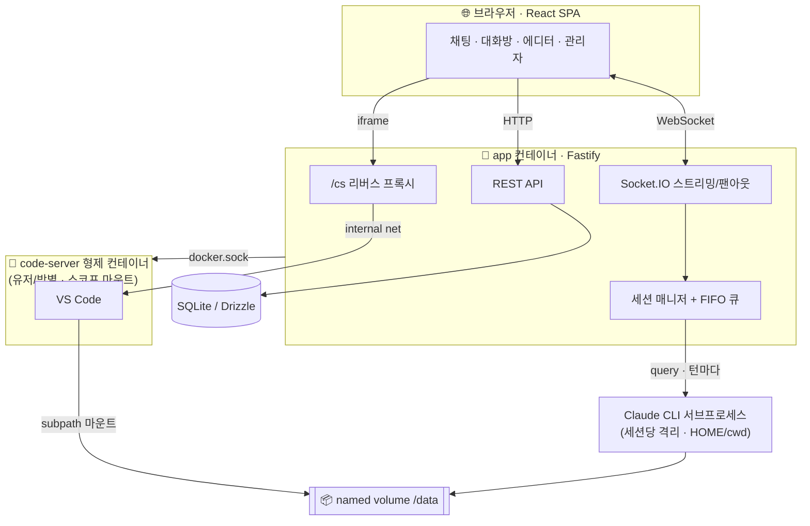

<div align="center">

[English](README.md) · **한국어**


# ClaudeCode Workspace

**서버 1대에 상주하는 Claude Code를, 팀 전체가 웹에서 함께 쓰는 워크스페이스.**

세션마다 격리된 Claude Code · 여러 명이 같이 쓰는 공유 대화방 · 브라우저 안의 VS Code까지 — 한 번의 `docker compose up`으로.

[](https://scian0204.github.io/ClaudeCodeWorkspace/)


<br/>


<sub>로그인 → 대화방 → 메시지 전송 → 웹에서 툴 승인 → 툴 실행 → 분할 뷰로 브라우저 속 VS Code까지 (MOCK 모드 데모)</sub>

<br/><br/>

**▶ [라이브 데모 보기](https://scian0204.github.io/ClaudeCodeWorkspace/)** — 설치도 로그인도 필요 없습니다. 백엔드만 목(mock)으로 바꾼 실제 UI라 스트리밍·툴카드·웹 권한 승인·대화방·LLM Wiki·관리자 패널까지 그대로 눌러볼 수 있습니다. 새로고침하면 데이터는 초기화됩니다.

</div>

---

## 목차

- [한눈에](#한눈에)
- [📸 기능 둘러보기](#-기능-둘러보기)
- [✨ 강점](#-강점)
- [🚀 빠른 시작](#-빠른-시작)
- [🧭 아키텍처](#-아키텍처)
- [🧩 기능 자세히](#-기능-자세히)
- [⚙️ 설정 (.env)](#️-설정-env)
- [🗂 구조](#-구조)
- [🔐 보안 posture](#-보안-posture)
- [🛣 로드맵](#-로드맵)
- [📜 업데이트 노트](CHANGELOG.ko.md) — 최초 설계부터 지금까지의 모든 릴리스
- [🤝 기여 · 라이선스](#-기여--라이선스)

---

## 한눈에

Claude Code CLI는 강력하지만 **내 터미널 하나**에 묶여 있습니다. ClaudeCode Workspace는 그 CLI를 **서버에 올려 팀 자산으로** 바꿉니다.

- 각자 브라우저로 접속 → **자기만의 격리된 Claude Code 세션**
- 필요하면 **단체 대화방**에 모여 하나의 Claude를 같이 부린다 (단톡방처럼)
- **동료에게 DM을 보내거나 그룹 채팅방을 만든다** — 클로드 없는 순수 사람 간 텍스트, 관리자는 그룹을 공통 프로젝트 방으로 승격 가능
- 승인이 필요한 위험한 작업은 **웹에서 실시간 승인/거부**
- 그 자리에서 **VS Code(code-server)** 를 열어 편집·터미널·git까지
- 아직 저장소가 아닌 프로젝트(가져온 프로젝트는 파일 뭉치로 들어옴)를 **git init & 원격 게시** — Git 패널에서 init·첫 커밋·등록해 둔 GitHub/GitLab/Bitbucket 계정에 저장소 생성·push 까지 한 번에, 또는 직접 입력한 주소로 push (`gitPublishEnabled`)
- 프로젝트별 **remote 수동 관리** — Git 패널에서 remote 목록·추가·주소 변경·삭제 (`origin` 을 바꾸면 push 자격증명도 그 호스트 기준으로 다시 결정)
- 클론한 저장소를 채팅 헤더에서 **가져오기(pull) · 커밋 · 푸시** (Claude가 대신 해줄 수도) — 암호화된 유저별 git 자격증명 사용. 마이페이지 › 프로젝트 목록에서도 프로젝트별 Git 버튼으로 같은 패널을 열 수 있어, 채팅에 붙이지 않은 프로젝트도 바로 pull 가능. pull 은 `--all` 로 모든 remote 를 fetch 해서 새로 만들어진 원격 브랜치까지 가져오고, 현재 브랜치는 기본 fast-forward 전용 — 로컬 커밋이 갈라졌으면 *리베이스로 가져오기* 를 켜면 됩니다
- **변경 내용(diff) 보기 · 히스토리 그래프** — Git 패널에서 변경 파일 이름을 누르면 그 파일의 uncommitted patch(추적되지 않은 새 파일도 전체가 추가된 형태로), 히스토리 섹션을 펼치면 브랜치·머지가 색깔 레인으로 그려진 커밋 그래프. 커밋을 누르면 그 커밋의 stat + patch (*모든 브랜치* 토글로 HEAD 밖의 브랜치까지, 상한은 `gitLogMaxCount`/`gitDiffMaxKB`). 팝업 제목줄의 버튼 하나로 **전체화면**으로 키우면 그래프와 patch 가 창을 다 씁니다
- 문서를 올리면 Claude가 컴파일해 주는 **LLM Wiki** 팀 지식 기반 — 기존 대화나 프로젝트 파일에서 시작하거나 빈 위키로 시작할 수도 있고, 어떤 대화·대화방에든 주제를 **연결**해 그 지식을 근거로 답하게 할 수 있다. 주제를 **대화로 지식 쌓기**로 켜두면 오간 대화에서 남길 만한 내용을 Claude가 스스로 판단해 물어보고 넣거나 바로 넣는다
- **로컬 세션 가져오기** — 프로젝트 폴더와 `~/.claude` 세션 파일을 업로드해 대화를 이어서 쓸 수 있는 개인 세션으로 복제. CLI에서 이름을 붙이지 않은 세션은 긴 임의 id 대신 첫 메시지로 이름이 붙고, 가져오기 화면에서 체크하면 대화내역을 읽어 제대로 된 이름을 지어 줌(`importAutoTitleEnabled`). 이미 있는 프로젝트와 세션은 각각 중복 표시되며 덮어쓰기/복제를 고를 수 있고, 프로젝트 폴더를 덮어쓸 땐 기존 파일을 유지할지 지울지도 함께 선택
- **채팅 안의 diff** — `Edit`/`Write` 툴 호출이 진짜 diff 카드로 렌더됨: 접힌 상태에선 `+N −N` 배지, 펼치면 추가/삭제 줄이 색상으로, 그리고 승인 프롬프트 안에도 같은 diff가 떠서 **허용 전에 무엇이 바뀌는지** 그대로 보임
- **세션 내보내기(다운로드)** — 가져오기의 반대: 채팅 헤더의 다운로드 버튼이 세션의 CLI 트랜스크립트(JSONL)를 로컬 프로젝트 경로로 `cwd`를 바꿔 내려주고, 놓을 위치(`~/.claude/projects/…`)와 `claude --resume <uuid>` 명령까지 그대로 안내 — 로컬 Claude Code에서 이어서 작업(`sessionExportEnabled`). 같은 창에서 **프로젝트 폴더째로** 받을 수도 있다 — 세션의 작업 폴더 전체 + 그 트랜스크립트를 `.claude/projects/…` 위치에 미리 넣어둔 `.tgz` 하나라, 파일이 아예 없는 머신에서도 그대로 이어갈 수 있다. 담을 파일은 한 폴더씩 펼치는 트리에서 직접 고른다 — `.gitignore`에 걸리는 항목과 `node_modules`처럼 다시 만들 수 있는 폴더는 미리 체크가 해제돼 있고, 체크를 바꾸면 받기 전에 크기가 바로 갱신된다(`sessionBundleEnabled`, `sessionBundleMaxMB`, `sessionBundleMaxFiles`, `sessionBundleExcludes`)
- **팀 에이전트** — 커스텀 에이전트(이름·설명·시스템 프롬프트·허용 툴·모델)를 한 번 정의하면 끝: 관리자가 팀 공통으로, 멤버가 개인용으로, 또는 **프로젝트 단위**로(그 프로젝트의 모든 세션에 적용 — 관리자·개인 프로젝트 소유자가 관리) 관리하고, 모든 세션에 Task 툴 서브에이전트로 적용되며, 채팅 헤더 pill로 **메인 스레드**를 맡길 수도 있음(다음 턴부터). 디스크의 에이전트 파일(`.claude/agents/*.md` — 세션 중 Claude가 직접 만든 것 포함)도 패널에 읽기 전용으로 표시됨(`teamAgentsEnabled`)
- **백업 & 복원 (서버 마이그레이션)** — 관리자 패널에서 워크스페이스 전체(SQLite 스냅샷 `VACUUM INTO` + 유저/방 홈·위키·브랜딩·리뷰 클론)를 `.tgz` 하나로 다운로드하고, 새 서버에서 업로드→검증 요약(버전·사용자 수·크기·암호화 키 일치) 확인→키워드 입력 후 적용하면 데이터를 교체하고 서버가 스스로 재시작. 이전 상태는 `.pre-restore`에 1회분 보관되어 수동 롤백 가능(`backupEnabled`, `backupIncludeReviews`, `restoreMaxMB`)
- **자동 PR 리뷰** — 열린 PR마다 파이프라인 자동 실행(머지→빌드/실행→버그·코드리뷰→병합 가능 판단), 한 번 클릭으로 원격 병합
- **워크스페이스 통합 검색**(`Ctrl/Cmd+K`) — 개인 대화, 참여 중인 공통 세션(방), DM·그룹 메시지, 프로젝트, LLM Wiki 주제·문서, PR 코드리뷰, 사람까지 한 번에 검색. 결과를 누르면 해당 메시지로 바로 이동(문서는 파일 탐색기로 열림). 정렬은 **최신순 / 오래된순**, 그 아래 **기능별 탭**(전체 · 개인 세션 · 대화방 · DM · 프로젝트 · LLM Wiki · 코드리뷰 · 사람)으로 필터. **관리자를 포함해 누구도 타인의 개인 대화·위키 스레드·개인 프로젝트·DM은 검색할 수 없음**(공유 대상 — 내가 속한 방·PR 리뷰·위키 지식 기반 — 은 그대로)
- **답변 뒤에서 돌아가는 것들 보기** — 채팅 헤더의 *작업* pill을 누르면 대화 오른쪽에 패널이 열려, 그 턴이 뒤에서 돌린 **서브에이전트·백그라운드 셸·워크플로·MCP 모니터**가 전부 나옴: 실행 상태, 경과 시간, 토큰·도구 호출 수, 지금 쓰고 있는 도구, 끝난 뒤의 요약/오류(에이전트 · 셸 · 워크플로 탭으로 필터). 서브에이전트가 실행한 도구 카드는 대화 본문에서도 배지로 구분되어 메인 스레드 호출과 헷갈리지 않고, 폰에서는 패널이 전체화면으로 열림. 관리자 설정(`taskPanelEnabled`)으로 끌 수 있음. 실행 중인 서브에이전트 줄의 **실시간** 버튼을 켜면 패널 안에 그 에이전트만의 창이 열려, 지금 쓰는 도구와 써 내려가는 글이 그대로 보임(새 줄이 오면 자동으로 따라 내려감). **분할 보기** 버튼을 누르면 모든 에이전트의 창이 한 번에 펼쳐져 팀 전체를 한 화면에서 볼 수 있음. Claude Code의 실험 기능인 **에이전트 팀**(`CLAUDE_CODE_EXPERIMENTAL_AGENT_TEAMS`)도 세션마다 켜져 있어서(`agentTeamsEnabled`), 팀원들이 각자 이름을 달고 이 창으로 진행 상황을 보냄. 다만 승인을 물어보는 모드에서는 Claude Code 쪽 문제 때문에 팀원이 한 번에 한 명씩만 일하므로, 여러 명이 동시에 움직이게 하려면 bypass 모드 세션이 필요함
- **채팅 헤더의 실시간 사용량 미터** — 세션별 **컨텍스트 윈도우** 사용률 + 내 **claude.ai 플랜 한도**(5시간·주간·모델별)를 재설정 카운트다운과 함께 CLI에서 바로 표시. 붙여넣은 `claude setup-token`은 모델을 돌릴 권한만 있어 계정의 한도 정보는 읽지 못하는데, 브라우저 로그인이 함께 있으면 한도 조회는 자동으로 그 로그인 자격을 사용함 — 로그인이 없으면 마이페이지에서 로그인하라고 안내. API 키·Bedrock·커스텀 제공자는 플랜 한도라는 개념 자체가 없음(쓴 만큼 과금)
- **브라우저로 Claude 계정 로그인** — 마이페이지가 공식 `claude auth login`을 대신 구동한다. 링크 열고 승인하고 코드 붙여넣으면 끝. 이렇게 받은 자격증명은 전체 스코프(`user:profile` 포함)를 가져서 플랜 한도가 보이고, 만료 시 자동 갱신되며, 자동 재개도 동작한다 — 붙여넣는 `setup-token`으로는 전부 불가능한 것들. 관리자는 **공용 계정**도 같은 방식으로 로그인해 공용 토큰을 대체할 수 있고, 개인 인증이 없는 멤버는 자기 홈·설정·대화기록을 유지한 채 그 계정으로 실행된다
- **세션별 모델 Effort** — 헤더 pill에서 추론 강도(낮음→최대)를 선택; 미지원 모델은 자동으로 낮은 단계로 조정
- **모델 목록 자동 가져오기** — 프론티어 모델은 버전이 자주 바뀌므로, 서버가 설정된 제공자의 `/v1/models`(Anthropic 또는 custom base URL)에서 최신 목록을 주기적으로 받아 모델 드롭다운을 갱신. 관리자 설정에서 [지금 가져오기]로 즉시 갱신하거나 끄고 손으로 편집 가능
- **세션 이름 자동 생성** — 첫 응답이 끝나면 아직 이름을 바꾸지 않은 개인 대화의 이름을 대화 주제로 지어 줌(가벼운 모델 1회 호출, 실패 시 첫 메시지로 폴백). 마이페이지에서 유저별로 on/off, 관리자 설정(`autoTitleEnabled`)으로 기능 전체를 끌 수 있음. 채팅 헤더의 ✨ 버튼(사이드바 각 행에도 있음)으로 아무 대화나 수동으로 다시 이름 지을 수 있고, 이때는 첫 메시지만이 아니라 앞쪽 여러 턴을 읽음
- **전용 대기 애니메이션** — "Claude가 생각하는 중"인 모든 자리에 범용 스피너 대신 이 프로젝트만의 시그니처 마크가 붙음: 로고의 점 세 개가 밝기가 다른 clay 색으로 차례차례 켜지며 물결처럼 흐르고, 옆 문구 위로는 옅은 광택이 한 번씩 지나감. 대화 **이름을 짓는 중**에는 ✨ 아이콘이 도는 clay 색 고리 안에서 커졌다 작아지고, 이름이 정해질 때까지 헤더와 사이드바의 제목도 같이 반짝임. 답변 출력·위키 문서 정리·순서를 기다리는 턴·이름 짓기가 모두 같은 표시를 씀. 동작 최소화 설정(`prefers-reduced-motion`)에서는 움직이지 않는 배지로 고정됨
- **5시간 한도 리셋 시 자동 재개** (Claude 구독 전용) — claude.ai 플랜 사용량 한도(5시간·주간)에 걸려 실패한 턴을 버리지 않음. 서버가 프롬프트를 보관하고 입력창 위에 재시도 예정 시각을 띄우며(취소 가능), 한도가 풀리면 자동으로 다시 보냄(재시작에도 유지). 마이페이지에서 유저별 opt-in, 관리자 설정(`autoResumeEnabled`)으로 기능 전체를 끌 수 있음. API 키·Bedrock/Vertex/커스텀 provider는 5시간 한도 자체가 없어 대상이 아님
- **5시간 창 자동 선점** (Claude 구독 전용) — claude.ai 5시간 창은 시계가 아니라 **첫 질의 시점**부터 카운트되므로, 리셋 후 그냥 두면 그 시간이 그대로 날아감. 켜 두면 5시간 카운트가 돌고 있지 않을 때 서버가 아주 짧은 질문(저렴한 모델, 대화 목록에는 남지 않음)을 한 번 대신 보내 카운트를 시작시킴 — 실제로 앉아서 일할 때 5시간이 온전히 남아 있게 하려는 것. 마이페이지에서 사용자별로 켜고(마지막으로 보낸 시각 표시), 관리자 설정(`windowPrimer*`)으로 조정하거나 끌 수 있음
- **유저별 Claude 토큰**으로 각자 실행(관리자 공통 토큰·env 폴백), 각 세션의 **사용량 미터**에서 컨텍스트 윈도우와 claude.ai 플랜 한도 확인
- **설명도 하고 실행도 하는 가이드** — 우측 하단 원형 버튼을 누르면 작은 어시스턴트 패널이 열림. 기능을 물으면 설명하고, 해달라고 하면 **직접 실행**함 — *"이 깃허브 주소로 개인 세션 만들어줘"*, *"이 스킬 추가해줘"*, *"언어 영어로 바꿔줘"*, *"5시간 선점 켜줘"*, *"단축키 알려줘"*, *"SQL 리뷰하는 에이전트 만들어줘"*, *"방금 작업 커밋하고 푸시해줘"*. 채팅·프로젝트/Git·룸·DM·위키·PR 리뷰·팀 에이전트·플러그인·토큰 모아쓰기·각 패널·관리자 설정까지 워크스페이스의 **모든** 기능을 알고 있고, 이 워크스페이스에서 꺼둔 기능은 추측 대신 꺼져 있다고 알려줌. 실행은 워크스페이스 자체 API를 **본인 세션으로** 호출하는 방식이라, 각 엔드포인트가 UI에서와 똑같은 권한 검사를 그대로 적용함: 멤버는 관리자 동작에 절대 도달할 수 없고(대신 승인 요청을 올려줌), 자격증명은 손대지 않으며, 삭제는 아예 불가능. 관리자는 읽기 전용으로 두거나 기능을 통째로 끌 수 있음(`guideEnabled`, `guideWriteEnabled`)
- **새로고침해도 유지되는 URL** — 모든 뷰가 자기 경로를 가짐(`/chat/:id`, `/room/:id`, `/wiki/:id`, `/review/:id`, `/dm/:id`, `/admin`, `/plugins`, `/me`). 새로고침하면 보던 화면 그대로, 딥링크 공유 가능, 브라우저 뒤로/앞으로가 탐색 이력을 따라 움직임
- **키보드 단축키** — 검색(`Ctrl/Cmd+K`)·새 대화(`Ctrl/Cmd+Shift+O`)·사이드바(`Ctrl/Cmd+B`)·처음 화면(`Ctrl/Cmd+Shift+H`)·테마(`Ctrl/Cmd+Shift+L`)·이전/다음 대화(`Alt+↑/↓`)·태스크/Git/파일 패널(`Ctrl/Cmd+Shift+E · G · F`)·보기 전환 대화→분할→에디터(`Ctrl/Cmd+Shift+\`)·입력창 포커스(`Shift+Esc`)·이전에 보낸 메시지 불러오기(입력창에서 `↑`/`↓`), 실행 중인 턴은 `Esc`로 중단. `?` 를 누르면 단축키 목록이 열리고, 키 표기는 플랫폼에 맞춰 표시됨(맥 ⇧⌘O / 윈도우·리눅스 Ctrl+Shift+O)
- **어디서나 뜨는 전용 우클릭 메뉴** — 우클릭하면 브라우저 기본 메뉴 대신 워크스페이스 동작이 뜨고, 메뉴는 **클릭한 지점에서 스스로 만들어짐**: 그 행/카드가 가진 버튼(대화 이름 변경·삭제, 플러그인 활성·삭제, 메시지 수정·삭제, 파일 트리 펼치기 — hover로 보이는 것 전부), 클립보드 동작(선택 영역·입력창·링크·이미지 주소·코드 블록·트리 행의 전체 경로 복사), 앱 공통 동작(새 대화·검색·사이드바·테마·단축키·새로고침) 순으로. 항목을 화면에서 거꾸로 읽어오므로 **나중에 추가되는 화면도 배선 없이** 우클릭 메뉴가 붙음. `Shift`+우클릭은 브라우저 기본 메뉴를 그대로 냄. 관리자 설정(`customContextMenu`)으로 기능 전체를 끌 수 있음
- **프로젝트별 대화 묶음** — 사이드바가 개인 대화를 각자의 작업 디렉터리(프로젝트) 아래로 모아 보여줌(공통 프로젝트 → 개인 프로젝트 → 미지정 순). 프로젝트 헤더를 눌러 접었다 펼 수 있고 접힘 상태는 브라우저에 기억되며, 대화의 프로젝트를 바꾸면 그 즉시 해당 묶음으로 이동
- **사이드바 접기** — 데스크톱에서 좌측 사이드바를 접어 대화를 전체 폭으로; 어느 화면이든 헤더의 햄버거로 다시 펼침(브라우저에 기억됨)
- **모바일 지원** — 반응형 레이아웃: 사이드바가 슬라이드 드로어로 접히고 대화가 전체 폭으로 표시(PWA 설치 가능)

> 개인 원격 셋업으로도 그대로 동작합니다 — 혼자라면 계정 1개짜리 "원격 Claude Code"가 됩니다.

---

## 📸 기능 둘러보기

<sub>아래 이미지는 모두 [라이브 데모](https://scian0204.github.io/ClaudeCodeWorkspace/)(MOCK 모드)에서 캡처한 **실제 UI**입니다 — 위 배지를 눌러 직접 눌러볼 수 있습니다.</sub>

### 💬 Claude와 대화 — 세션별 · 스트리밍 · 툴 카드


모든 유저가 **각자 격리된 Claude Code 세션**(별도 CLI 서브프로세스)을 가집니다. 답변은 serif 트랜스크립트에 토큰 단위로 스트리밍되고, 각 툴 호출은 **접이식 카드**(명령 + 출력)로 표시되며, `/clear`·`/compact` 마다 그 위 대화가 **타임스탬프 토글로 접혀** 스크롤이 무한정 늘어나지 않습니다.

턴이 도는 동안 **지금 무엇을 하고 있는지**도 보입니다. 확장 사고(extended thinking) 중에는 텍스트가 나오기 전부터 *생각 중…* 표시가 뜨고, **출력 토큰 미터**가 스트리밍에 맞춰 실시간으로 올라가다 메시지가 끝날 때 SDK의 정확한 집계로 보정됩니다. 입력창은 **내용에 따라 일정 높이까지 늘어나고**(그 이상은 스크롤), **타이핑하는 대로 마크다운을 하이라이트**합니다 — 코드 스팬, 굵게, 취소선, 제목, 인용, `-`/`1.` 목록, `@` 참조, `/` 명령어. 입력창 첫 줄에서 `↑`를 누르면 **그 대화에서 내가 이전에 보낸 메시지가 그대로 다시 채워집니다**(터미널 명령 기록과 같은 방식 — 채팅·DM·가이드 패널 모두). `↓`로 최근 쪽으로 돌아오고, 끝까지 오면 쓰던 내용이 복원됩니다.

### 🛡 웹 권한 승인 — 브라우저에서 툴 실행을 즉시 허용


Claude는 위험한 툴을 쓰기 직전 멈추고 브라우저에 물어봅니다: **허용 / 거부 / 항상 허용**. 격리 차단막(타 유저 경로·`~/.claude`·핵심 경로)은 권한 모드와 무관하게 항상 적용됩니다.

### 📊 실시간 사용량 · ⚡ 세션별 Effort · 🎛 모델 & 모드

<table>
<tr>
<td width="50%"></td>
<td width="50%"></td>
</tr>
<tr>
<td valign="top">채팅 헤더의 <b>사용량 미터</b> — 세션별 <b>컨텍스트 윈도우</b> 사용률과 <b>claude.ai 플랜 제한</b>(5시간·주간·모델별)을 리셋 카운트다운과 함께 CLI에서 그대로 표시합니다. 한도 조회는 추론 전용 붙여넣기 토큰보다 전체 스코프 브라우저 로그인을 우선 사용하므로 한도가 실제로 뜹니다. 헤더 pill로 <b>모델</b>·<b>추론 Effort</b>(low → max)·<b>권한 모드</b>도 전환합니다. 답변이 도는 동안에는 대기 표시 옆에 <b>실시간 토큰 수</b>가 입력·출력 양쪽으로 올라갑니다 — 입력은 Claude가 일을 시작하는 순간부터 반영되므로, 화면에 글이 나오기 전(생각 중·도구 실행 중)에도 숫자가 멈춰 있지 않습니다. 명령 실행이 연달아 나오면 <b>한 줄로 접히고</b>("명령 4개 · Bash ×2, Read, Edit"), 아직 실행 중이거나 실패한 명령이 있으면 펼친 채로 둡니다.</td>
<td valign="top"><b>슬래시 명령 팔레트</b> — <code>/</code>를 입력하면 내장·플러그인·스킬 명령(및 <code>/split</code> 같은 클라이언트 뷰 액션)이 뜹니다. 퍼지 검색되며 <code>@</code> 메뉴와 같은 느낌. CLI가 터미널 화면으로만 그리는 명령(<code>/permissions</code>·<code>/export</code>·<code>/login</code>·<code>/resume</code>·<code>/theme</code>·<code>/plan</code>·<code>/diff</code>·<code>/tasks</code>·<code>/help</code> 등)은 여기서 <i>"isn't available in this environment"</i>만 돌려주던 것을, 이제 워크스페이스의 같은 기능(권한 모드 pill·내보내기 창·내 페이지·검색 팔레트·단축키 도움말·작업/Git/파일 패널·에디터 뷰)으로 대신 실행합니다.</td>
</tr>
</table>

### 🤝 요금제 함께 쓰기 · 📦 세션 전용 빌드 컨테이너

**요금제 함께 쓰기** — 자기 Claude 요금제를 등록한 사람끼리 모아서 씁니다. 질문을 보낸 사람 것만이 아니라 모임 참여자의 요금제로 실행되고, 한 사람 사용량이 다 차면 같은 질문이 실패하지 않고 다음 사람 요금제로 이어집니다. 어떤 모임을 쓸지는 좁은 것부터 3단계로 정해집니다 — **세션 지정**(모임 하나, 또는 "각자 요금제"로 끄기 · 공유 대화방도 세션 하나), 질문한 사람의 **개인 기본 모임**(마이페이지에서 지정), 그리고 **전체 사용자 함께 쓰기** — 관리자 스위치 하나로 요금제를 등록한 모든 사용자가 묶이며, 만들거나 가입할 것이 없습니다(개인은 자기 요금제만 뺄 수 있습니다). 참여는 언제나 본인이 직접 신청하며(남의 요금제를 대신 넣을 수 없습니다), 각 답변에는 누구의 요금제로 실행됐는지 표시됩니다. 기본은 꺼짐이고 관리자가 켭니다.

**세션 전용 빌드 컨테이너** — 모든 세션이 앱 컨테이너 하나를 같이 쓰기 때문에, 두 사람이 동시에 `npm run dev`나 테스트를 돌리면 포트와 캐시가 겹칩니다. 헤더에서 켜면 그 세션만 쓰는 별도 컨테이너가 생기고, 설치·빌드·개발 서버·테스트는 Claude가 쓰도록 안내받은 도구를 통해 거기서 돌아갑니다. git이나 파일 작업은 그대로 기존 셸을 씁니다. 컨테이너는 질문 사이에도 살아 있어 설치한 의존성이 유지되고, 세션이 한동안 조용하면 내려갑니다. 기본은 꺼짐이고 관리자가 켭니다.

### 📎 `@` 파일 참조 · 🖇 첨부 & 붙여넣기


프로젝트 채팅에서 `@`를 입력하면 **파일·폴더**를 퍼지 검색해 `@경로` 참조를 메시지에 넣을 수 있습니다 — 컴포저를 떠나지 않고 Claude에게 파일을 지목. 아무 파일이나 첨부하거나 **클립보드 스크린샷을 붙여넣기/드래그**할 수도 있고, 이미지는 Claude에게 시각적으로 렌더링됩니다.

### 👥 공유 대화방 + 세밀한 권한 위임

<table>
<tr>
<td width="55%"></td>
<td width="45%"></td>
</tr>
</table>

**공유 대화방**에 모여 하나의 Claude를 함께 조종합니다(그룹 채팅처럼). FIFO 큐가 다자 턴을 순서대로 처리하고, 컴포저 토글이 **팀 채팅**과 **Claude 지시**를 분리합니다(`@claude`로 소환). 소유자는 **권리별로 위임**합니다: 승인 · 인터럽트 · 초대 · 강퇴 · 소유권 이전 · 방 삭제.

### 💬 DM & 그룹 채팅 — Claude 없는 순수 사람 메시징


Claude 대화방과 완전히 분리된, **모든** 유저를 위한 가벼운 메시징 레이어 — WebSocket 기반 1:1 DM과 이름 있는 그룹 채널, 안읽음 배지 포함. 관리자는 **그룹 채널을 공통 프로젝트 방으로 승격**할 수 있습니다.

### ⑂ Git 커밋 & 푸시 · 🧑‍💻 브라우저 속 VS Code

<table>
<tr>
<td width="50%"></td>
<td width="50%"></td>
</tr>
<tr>
<td valign="top">채팅 헤더에서 <b>Git 커밋 &amp; 푸시</b> — 파일 단위 스테이징, 푸시, 브랜치 전환(로컬/원격), 파일별 diff와 레인으로 그린 커밋 히스토리 그래프, 유저별 암호화 PAT 자격증명(관리자 공통 폴백). 어떤 자격증명·커밋 아이덴티티가 적용 중인지 정확히 보여줍니다.</td>
<td valign="top"><b>VS Code(code-server)</b>가 유저/방별 형제 컨테이너로 즉시 뜹니다 — 브라우저 속 에디터·터미널·git을 채팅과 나란히(<i>데모는 플레이스홀더; 에디터는 Docker 배포 필요</i>).</td>
</tr>
</table>

### 📚 LLM Wiki · 🔀 자동 PR 리뷰

<table>
<tr>
<td width="50%"></td>
<td width="50%"></td>
</tr>
<tr>
<td valign="top"><b>LLM Wiki</b> — 문서/이미지 폴더를 업로드하면 Claude가 질의 가능한 지식베이스로 컴파일. 모든 답변이 참고한 파일을 <b>인용 출처 패널</b>에 나열하고, 호버하면 본문 언급이 하이라이트됩니다.</td>
<td valign="top"><b>자동 PR 리뷰</b> — 각 오픈 PR이 파이프라인을 자동 실행(병합 → 샌드박스 빌드/실행 → 버그+코드 리뷰 → <b>MERGE_SAFE / DO_NOT_MERGE 판정</b>). 관리자 클릭 한 번으로 원격에서 병합.</td>
</tr>
</table>

### 👤 마이페이지 — 내 설정을 한 곳에


**프로필 이미지**, **Claude 토큰**, **LLM Provider 대체**(Bedrock / Vertex / 커스텀 base URL), **git 자격증명**, **개인 프로젝트** 관리를 모은 유저별 설정 페이지. 관리자 전용 액션(공통 프로젝트 생성, 새 위키 토픽, 관리자 권한 요청)을 **실제 기능 폼 그대로 여기서 요청**할 수 있습니다.

### 🎛 모든 것을 설정 — 관리자 패널

<table>
<tr>
<td width="33%"><br/><sub><b>개요</b> — 유저·방·세션·스로틀·공통 토큰.</sub></td>
<td width="33%"><br/><sub><b>설정</b> — 모든 운영 노브를 실시간 편집.</sub></td>
<td width="33%"><br/><sub><b>리소스</b> — 앱이 띄운 컨테이너·이미지·남은 찌꺼기 정리.</sub></td>
</tr>
<tr>
<td width="33%"><br/><sub><b>활동</b> — 턴·큐·컨테이너 실시간 작업 관리자.</sub></td>
<td width="33%"><br/><sub><b>요청</b> — 멤버 요청 승인/거절.</sub></td>
<td width="33%"></td>
</tr>
</table>

### 🔌 플러그인 · 🌐 다국어 · 📱 반응형(PWA)

<table>
<tr>
<td width="40%"></td>
<td width="40%"></td>
<td width="20%"></td>
</tr>
<tr>
<td valign="top"><b>2-클래스 플러그인</b> — 공통(관리자)·개인(유저) 티어; git·업로드 설치, 플러그인별 상세 + 원클릭 업데이트.</td>
<td valign="top"><b>다국어 UI</b> — 사이드바에서 한/영 즉시 전환, 저장 + 브라우저 언어 자동 감지.</td>
<td valign="top"><b>폰에서도 동작</b> — 사이드바가 드로어로 접히고 채팅이 전체 폭으로; PWA로 설치 가능.</td>
</tr>
</table>

---

## ✨ 강점

|  | 강점 | 설명 |
|---|---|---|
| 🧬 | **진짜 세션 격리** | "하나의 배포"지만 런타임은 세션마다 별도 프로세스. Agent SDK가 턴마다 `HOME`/`cwd`/plugins를 주입해 유저·방별로 완전히 분리 |
| 👥 | **공유 대화방 + 세밀한 위임** | 방장이 멤버별로 승인·중단·초대·추방·방장이양·방삭제 권한을 토글. FIFO 큐로 다자 대화 정렬, 발화자 프리픽스로 모델이 화자 인식. 작성창 토글로 **팀 잡담**과 **클로드 지시**를 구분(`@클로드`로 호출) — 잡담은 턴을 트리거하지 않음 |
| 🛡 | **웹 권한 프롬프트** | Claude가 툴을 쓰기 직전 멈추고 브라우저에 허용/거부/항상. 다른 사용자 경로·`~/.claude`·핵심 경로는 어떤 권한 모드에서도 항상 차단 |
| 🧑‍💻 | **브라우저 속 VS Code** | 프로젝트를 code-server 컨테이너로 즉시 배포. 자기 볼륨 + 공통만 마운트(격리), 유휴 시 자동 회수 |
| 👁 | **프로젝트 파일 변경 감지** | 대화가 보고 있는 프로젝트를 다른 곳에서 고치면 그 대화가 알 수 있다 — 다른 대화의 작업, VS Code 편집, git pull 등. 헤더 버튼에서 동작을 고른다: 안 함, 무엇이 바뀌었는지 목록으로 보여주는 알림 카드(사이드바 행에도 점 표시), 또는 알림과 함께 미리 저장해 둔 프롬프트를 턴으로 자동 발신(`{files}`·`{count}`·`{project}` 자동 치환). 추가·수정·이름 변경·삭제 모두 알린다. 그 대화가 작업 중일 때 생긴 변경은 카드에 그렇게 표시되고 자동 발신은 하지 않는다 — 방금 자기가 쓴 파일로 또 질문을 보내면 끝없이 반복되기 때문. 자동 발신에는 최소 간격이 있어 같은 프로젝트를 보는 두 대화가 서로에게 반응하는 속도도 제한된다 (`projectWatchEnabled`·`projectWatchPromptEnabled`·`projectWatchScope`) |
| 🔌 | **2-클래스 플러그인** | 공통(관리자)·개인(유저) 티어. git·로컬 업로드 설치, 관리자 필수강제, 유저별 on/off. 플러그인별 상세 보기 + 원클릭 업데이트 |
| 🪪 | **유저별 Claude 토큰** | 멤버가 각자 토큰 등록(암호화 저장), 사용량·비용을 개인별로 귀속. 관리자 공통 토큰 → env 순으로 폴백 |
| 🔀 | **LLM Provider 대체** | 기본 Claude 인증 토큰 대신 다른 LLM 백엔드로 턴을 실행(유저별 또는 관리자 공용, 암호화 저장). **Amazon Bedrock**·**Google Vertex AI**의 Claude 모델은 네이티브 지원, **OpenAI/ChatGPT/로컬 LLM**은 Anthropic 호환 프록시 base URL(LiteLLM·claude-code-router·Ollama shim 등)로 연결. 해석 순서: 유저 provider → 유저 토큰 → 공용 provider → 공용 토큰 → MOCK. 설정하지 않으면 기존 Claude 토큰 방식 그대로. `llmProvidersEnabled` 설정으로 켜고 끔 |
| 👤 | **마이페이지** | 프로필 이미지(업로드/제거, 본인 사이드바·마이페이지에 표시)·Claude 토큰·LLM Provider 대체·Git 자격증명·개인 프로젝트 관리(생성/삭제/새 대화에서 열기)를 한 페이지에 모은 유저별 설정 화면 |
| ⑂ | **Git 커밋 & 푸시** | 클론한 프로젝트를 채팅 헤더에서 바로 커밋(파일 단위 스테이징)·푸시·브랜치 전환(로컬/원격) — Claude가 직접 커밋/푸시도 가능. 클론은 전체 히스토리(모든 브랜치)를 받으며 특정 브랜치를 지정할 수 있음. GitHub/GitLab/Bitbucket용 HTTPS PAT 자격증명을 유저별로 암호화 저장(관리자 공용 폴백), 클론 시 선택, 호스트로 해석. 해당 저장소에 실제 적용되는 자격증명(내 것/공용)과 커밋 작성자를 패널에서 바로 확인 — 인증 실패 원인 파악이 쉬움 |
| 📚 | **LLM Wiki 지식 기반** | 문서/이미지 폴더를 올리면 Claude가 상호링크된 아티클로 컴파일, 유저는 읽기 전용 스레드로 질의. 업로드 대신 **기존 대화(개인·공통 세션)** 나 **프로젝트 파일**(`.gitignore` 제외, 개수·용량 한도)에서 시작하거나 **빈 위키**로 시작할 수도 있음. 이미 컴파일된 위키는 임포트로 컴파일 생략. 관리자는 기존 주제에 원본을 추가하거나 텍스트 원본을 그 자리에서 수정한 뒤 한 번만 재컴파일 |
| 🔗 | **대화에 위키 연결** | 일반 대화·대화방 헤더의 버튼으로 주제를 연결하면, 그 세션의 질문은 해당 지식 기반을 먼저 찾아본 뒤 답한다(세션의 프로젝트는 그대로). 읽기 전용 — 연결한 대화가 위키를 고치는 일은 없다 (`wikiLinkEnabled`) |
| 🌱 | **대화로 자라는 위키** | 주제에 연결된 대화가 끝나면, 남길 만한 지식이 나왔는지 Claude가 스스로 판단한다. 주제별로 그 다음 동작을 고른다: 아무것도 안 하기, 입력창 위에 카드로 물어보기(추가하기 전에 글 내용을 볼 수 있음), 바로 넣기. 추가한 글은 원본 쪽에도 같이 저장돼 나중에 재컴파일해도 사라지지 않는다 (`wikiAutoLearnEnabled`) |
| 🔀 | **자동 PR 리뷰** | 관리자가 원격지를 등록(병합권한 자격증명 필요), 서버가 GitHub/GitLab/Bitbucket을 폴링(또는 **웹훅 수신 시 즉시**)해 열린 PR마다 리뷰 세션 생성 — 관리자와 PR 작성자(읽기 전용)만 열람. 새 PR마다 **파이프라인 전자동**: 로컬 머지 → 빌드/실행 → 버그 감지·코드 리뷰 → **MERGE_SAFE / DO_NOT_MERGE 판단**. 관리자 지시 시 한 번 클릭으로 자격증명을 써서 **원격에서 PR 병합** |
| 🎛 | **모든 설정을 관리자 페이지에서** | 설정 레지스트리 한 곳에서 운영 노브 전부 — 동시 턴 캡, 모델 목록·기본값, 리뷰 파이프라인(폴 주기, 자동/코멘트 토글, 샌드박스 이미지·한도·타임아웃), code-server 이미지·유휴 시간, git 타임아웃, 세션 수명, 업로드/본문/소켓 한도 — 을 그룹별로 **실시간 편집**(대부분 즉시 적용, 일부는 *재시작 필요* 표시). env는 기본값 시드일 뿐, 인프라·시크릿은 읽기전용 표시 |
| 🏷 | **커스텀 로고 · 타이틀 (화이트라벨)** | 관리자가 **관리자 → 설정 → 브랜딩**에서 로고(PNG/JPEG/WebP/GIF/SVG)를 올리고 워크스페이스 이름을 지정하면 모든 사용자에게 바로 반영 — 사이드바·로그인 화면·시작 화면·브라우저 탭(파비콘). 이름을 비우거나 로고가 없으면 기본 제품명·기본 마크로 폴백 |
| 🩺 | **Docker 연결 상태를 먼저 알려줌** | 세 기능이 Docker 데몬에 의존함(code-server 에디터·PR 리뷰 샌드박스·자체 업데이트). 각 기능이 쓰는 순간에 터지게 두지 않고, 서버가 시작할 때와 주기적으로 Docker 연결을 미리 확인함. 연결이 안 되면 부팅 로그에 남고, 관리자 **개요**에 실제 사유(소켓 미마운트 / 권한 거부 / 데몬 무응답 / `DATA_VOLUME`·`CODE_SERVER_NETWORK` 미설정 / 데이터 볼륨이 `DATA_DIR` 경로에 마운트되지 않음)와 조치 방법, **다시 확인** 버튼이 배너로 뜸. 에디터·분할 화면은 눌러 봐야 실패하는 대신 애초에 비활성으로 두고, 마우스를 올리면 사유가 뜸. 나머지(채팅·프로젝트·위키·검색·DM)는 정상 동작 |
| ⬆️ | **원클릭 자체 업데이트** | 관리자 **업데이트** 탭에서 현재 실행 버전과 자기 이미지에 배포된 최신 태그를 비교하고, **워크스페이스 안에서 워크스페이스를 갱신**함. 새 이미지를 받은 뒤 컨테이너 교체는 잠깐 뜨는 도우미 컨테이너가 맡음: 새 컨테이너를 **먼저 만들어** 설정이 올바른지 확인하고(설정이 잘못돼도 서비스가 멈추지 않음), 기존 컨테이너를 정상 종료해 SQLite를 안전하게 닫은 다음 새 컨테이너를 지켜봄 — 죽거나 재시작을 반복하면 **이전 이미지로 자동 복구**. 패널은 스스로 재접속해 결과(실패 시 헬퍼 로그까지)를 보여줌. pull 대상은 앱 자신의 repo로 제한. `selfUpdateEnabled`로 on/off, 주기 확인은 확인만 하고 절대 자동 적용하지 않음 |
| 🧹 | **리소스 정리 (호스트 도커 포함)** | 관리자 **리소스** 탭에서 앱이 생성한 컨테이너(code-server 에디터 + 리뷰 샌드박스, 고아 감지 포함)·참조/댕글링 이미지·고아 디렉터리/DB 레코드를 스캔하고, 리소스별 정리 또는 이중 확인 **전체 초기화**로 청소. 앱이 생성한 컨테이너·댕글링 이미지·진짜 고아만 제거하고 사용자·방 프로젝트·계정·채팅 세션은 절대 건드리지 않음. `resourceCleanupEnabled`로 on/off |
| 🎛 | **활동 · 프로세스 관리** | 관리자 **활동** 탭 = 서버가 돌리는 모든 것을 보는 라이브 작업관리자: 실행 중인 Claude 턴, 대기 큐 메시지, code-server 에디터 + 리뷰 샌드박스 컨테이너, 실행 중 리뷰 파이프라인 — 각 행마다 개별 제어(인터럽트/취소/종료). 탭이 열려 있는 동안 자동 폴링(`processPollMs`) |
| 🙋 | **멤버 요청 → 관리자 승인** | 일반 유저가 관리자 전용 동작(공통 프로젝트 생성, LLM Wiki 주제 생성, 관리자 권한 요청)을 사유와 함께 요청하고, 관리자는 **요청** 탭(대기 배지 포함)에서 승인/거부. 요청은 **실제 기능 폼을 그대로 사용** — 공통 프로젝트 요청은 관리자 생성 폼과 동일하게 git clone URL·브랜치·자격증명 선택을 담고, 승인 시 실제 clone까지 수행(자격증명은 요청자 기준으로 재검증). 승인 시 서버가 동작을 실행하고 결과를 저장 — 작은 액션 레지스트리라 요청 가능한 동작 추가는 한 곳만 수정하면 됨. 권한 승격은 항상 요청자 본인만 승격되며 payload로 다른 유저를 지정할 수 없음. `approvalsEnabled`로 on/off |
| 💬 | **DM · 그룹 채팅** | 클로드 대화방과 완전히 분리된, **모든 유저**가 쓰는 가벼운 사람 간 메시지 계층 — 1:1 DM과 이름 있는 그룹 채널을 WebSocket으로 주고받고 안 읽음 배지 표시. 클로드도 큐도 없음. 같은 두 사람 간 DM은 중복 생성되지 않고, 모든 열람/전송은 서버에서 멤버십 검증. 관리자는 **그룹 채널을 (멤버 그대로) 공통 프로젝트 방으로 승격** 가능. `dmEnabled`로 on/off |
| 🔑 | **키 없이도 완전 동작** | 토큰이 어디에도 없으면 **MOCK 모드**로 스트리밍·권한·툴카드 UX가 그대로 시연됨 → 평가·데모·CI에 최적 |
| 🐳 | **한 방 배포** | 멀티스테이지 단일 이미지 + `docker compose up`. code-server는 필요할 때마다 옆에 별도 컨테이너로 띄움(별도 관리 도구 불필요) |
| 💭 | **사이드 채팅 (`/btw`)** | 진행 중인 작업에 대해, 그 대화에 남기지 않고 물어보기. 대화 위에 작은 창이 뜨고 대화를 *복사한* 상태에서 답하므로 Claude는 지금까지 오간 내용을 다 알지만, 대화 기록은 그대로 남고 다음 실제 턴도 영향을 받지 않음. 읽기 전용(파일 조회는 되지만 수정·명령 실행은 불가)이며 저장하지 않음 — 물어본 탭에서만 살아 있음. `/btw` 로 열고, `/btw 질문` 이면 바로 물어봄. 관리자 플래그 `asideEnabled` |
| 🗂 | **대화 히스토리 접기** | `/clear`·`/compact` 시 위쪽 대화를 타임스탬프가 붙은 토글로 접어 쌓음 — 무한 스크롤 대신 한 번의 클릭으로 과거 대화 열람 |
| 📎 | **`@` 파일·폴더 참조** | 프로젝트가 연결된 모든 채팅에서 `@` 입력 시 파일·폴더를 퍼지 검색하는 미리보기 메뉴가 뜸(`/` 명령어와 동일한 즉시 메뉴 UX). 골라 넣으면 메시지에 `@경로`가 삽입돼 컴포저를 벗어나지 않고 Claude에게 특정 파일을 가리킬 수 있음 |
| 🖇 | **파일 첨부·스크린샷 붙여넣기** | 컴포저에 아무 파일이나 첨부하거나, 클립보드 스크린샷을 그대로 붙여넣기(드래그&드롭도 가능). 업로드는 세션 워크스페이스에 대기하고 그 경로가 프롬프트에 실려 Claude가 읽음(이미지는 시각적으로 인식). 썸네일/칩이 컴포저와 대화 내역에 인라인 표시되며(**이미지 썸네일을 클릭하면 라이트박스로 전체 크기 보기**), 파일당 크기·개수 한도는 관리자 설정 가능 |
| 🎨 | **데스크톱 앱 급 UI** | Claude Code 데스크톱을 따른 clay 테마, 라이트/다크, 접이식 툴카드, serif 응답, 멤버 아바타·presence |

---

## 🚀 빠른 시작

### 개발 모드

```bash
npm install
cp .env.example .env      # 키 넣으면 실제 Claude, 비우면 MOCK 모드
npm run dev               # server :3000  +  Vite :5173 (프록시)
```

→ http://localhost:5173 접속 · 초기 관리자 **admin / admin** (배포 후 꼭 변경)

### 프로덕션 (Docker)

```bash
cp .env.example .env      # SESSION_SECRET, ANTHROPIC_API_KEY 설정
docker compose up -d --build
```

→ http://localhost:3000 · 단일 이미지가 API·WebSocket·정적 SPA·code-server 프록시를 모두 서빙

**클론·파일 불필요 — `docker run` 한 줄** (쉘 골라서 그대로 붙여넣기):

<details open><summary>Linux / macOS — bash / zsh</summary>

```bash
docker run -d --name claudecode-app \
  -p 3000:3000 \
  -v /var/run/docker.sock:/var/run/docker.sock \
  -v claudecode-workspace_data:/data \
  -e DATA_DIR=/data \
  -e SESSION_SECRET=$(openssl rand -hex 32) \
  -e ANTHROPIC_API_KEY=sk-ant-... \
  -e CODE_SERVER_NETWORK=claudecode_internal \
  -e DATA_VOLUME=claudecode-workspace_data \
  cian0204/claudecode-workspace:latest
```
</details>

<details><summary>Windows — PowerShell</summary>

```powershell
docker run -d --name claudecode-app `
  -p 3000:3000 `
  -v /var/run/docker.sock:/var/run/docker.sock `
  -v claudecode-workspace_data:/data `
  -e DATA_DIR=/data `
  -e SESSION_SECRET=$([guid]::NewGuid().Guid + [guid]::NewGuid().Guid) `
  -e ANTHROPIC_API_KEY=sk-ant-... `
  -e CODE_SERVER_NETWORK=claudecode_internal `
  -e DATA_VOLUME=claudecode-workspace_data `
  cian0204/claudecode-workspace:latest
```
</details>

<details><summary>Windows — CMD</summary>

```bat
docker run -d --name claudecode-app ^
  -p 3000:3000 ^
  -v /var/run/docker.sock:/var/run/docker.sock ^
  -v claudecode-workspace_data:/data ^
  -e DATA_DIR=/data ^
  -e SESSION_SECRET=replace-with-a-long-random-string ^
  -e ANTHROPIC_API_KEY=sk-ant-... ^
  -e CODE_SERVER_NETWORK=claudecode_internal ^
  -e DATA_VOLUME=claudecode-workspace_data ^
  cian0204/claudecode-workspace:latest
```
</details>

→ http://localhost:3000 · 초기 관리자 **admin / admin**. 앱이 부팅 시 `claudecode_internal` 네트워크를 자동 생성함(브라우저 VS Code용). 편집기 없이 쓸 거면 마지막 두 `-e` 줄 제거. 버전 고정은 `:latest` 대신 `:1.1.0`.

compose 파일이 편하면? build 없는 [`docker-compose.hub.yml`](docker-compose.hub.yml)도 배포돼 있음 — `curl -O` 후 `docker compose -f docker-compose.hub.yml up -d`.

> **요구사항:** code-server 편집기는 Docker 배포에서만 동작하며, 볼륨 subpath 마운트를 위해 **Docker Engine ≥ 26**이 필요합니다.

### 완전 로컬 — 데이터가 밖으로 안 나감

세션마다 Claude Code CLI를 서브프로세스로 돌리므로 **`ANTHROPIC_BASE_URL`**을 그대로 따름. 내장 **LLM Provider → `custom`** 설정(마이페이지=유저별, 관리자 패널=공용)을 로컬 Anthropic-호환 게이트웨이로 지정하면 *`api.anthropic.com`으로 요청이 아예 안 나감*:

**Ollama**(≥ 0.14)·**vLLM**·**LM Studio**·**llama.cpp**는 이제 *네이티브* Anthropic `/v1/messages` 엔드포인트를 제공 → Claude Code가 **프록시 없이 직결**. 최소 스택 = 모델 런타임 + 앱:

```yaml
# docker-compose.local.yml  ·  docker compose -f docker-compose.local.yml up -d
services:
  ollama:            # 네이티브 Anthropic 엔드포인트 — up 후: docker compose -f docker-compose.local.yml exec ollama ollama pull qwen3-coder
    image: ollama/ollama
    volumes: [ollama:/root/.ollama]
    networks: [internal]

  app:
    image: cian0204/claudecode-workspace:latest
    pull_policy: always
    ports: ["3000:3000"]
    volumes:
      - /var/run/docker.sock:/var/run/docker.sock
      - data:/data
    environment:
      SESSION_SECRET: change-me-to-a-long-random-string
      CODE_SERVER_NETWORK: claudecode_internal
      DATA_VOLUME: claudecode-workspace_data
    networks: [internal]

networks: { internal: { name: claudecode_internal } }
volumes: { data: { name: claudecode-workspace_data }, ollama: {} }
```

<details><summary>그냥 <code>docker run</code>으로?</summary>

```bash
docker network create claudecode_internal
docker run -d --name ollama --network claudecode_internal -v ollama:/root/.ollama ollama/ollama
docker exec ollama ollama pull qwen3-coder
docker run -d --name claudecode-app --network claudecode_internal \
  -p 3000:3000 \
  -v /var/run/docker.sock:/var/run/docker.sock \
  -v claudecode-workspace_data:/data \
  -e DATA_DIR=/data \
  -e SESSION_SECRET=$(openssl rand -hex 32) \
  -e CODE_SERVER_NETWORK=claudecode_internal \
  -e DATA_VOLUME=claudecode-workspace_data \
  cian0204/claudecode-workspace:latest
```
</details>

그다음 **앱에서** → **LLM Provider → 타입 `custom`**, base URL `http://ollama:11434`, auth token `ollama`(아무 값), model = 받은 모델명(예: `qwen3-coder`). `ANTHROPIC_API_KEY` 불필요 — provider 설정이 대신함. **LiteLLM** 같은 프록시는 네이티브 Anthropic 엔드포인트가 *없는* 백엔드(순수 OpenAI-only 서버)거나 여러 provider로 라우팅할 때만 필요.

앱 + `codercom/code-server` 이미지를 최초 1회 pre-pull 하면 전체 스택 — 앱·데이터·편집기·**추론**까지 오프라인 동작. 앱 상태(세션·대화방·업로드·SQLite)는 항상 data 볼륨에 로컬 저장. 기본값에선 LLM 호출만 외부이며, 위 단계로 그것도 없앰.

#### 비필수 전송 — 기본 차단

호스팅 API를 쓰더라도 워크스페이스는 **`BLOCK_NONESSENTIAL_TRAFFIC=1`** 상태로 배포되므로, 에이전트 CLI가 앤트로픽에 보내는 건 *추론 요청뿐*. 모든 세션에서 — 그리고 새로 뜨는 편집기 컨테이너에도 주입되어 — 다음이 꺼짐: 사용량 텔레메트리, 에러 리포트, `/feedback` · `/bug` · `/share`(대화 전문 + 코드를 그대로 업로드), 세션 만족도 설문과 트랜스크립트 업로드 후속 질문, 부가 모델 호출, 오토업데이트 핑, WebFetch 도메인 사전검사(호스트명을 `api.anthropic.com`으로 전송), Artifact 게시, 공식 마켓플레이스 자동설치, OpenTelemetry 익스포트. **관리자 → 설정 → 프라이버시**에 마스터 스위치 + 항목별 설명 붙은 개별 토글. 체크는 언제나 *차단*을 뜻함. 마스터는 오버라이드 — 켜져 있으면 전부 차단되고 개별 항목은 잠김. 끄면 채널별로 고를 수 있음(예: 자체 OTel 컬렉터로 지표를 받으려면 텔레메트리만 열고 나머지는 차단 유지). 이때 우산 변수 `CLAUDE_CODE_DISABLE_NONESSENTIAL_TRAFFIC`는 그것이 덮는 채널이 *전부* 차단일 때만 설정되므로, 일부러 연 채널이 조용히 다시 막히는 일 없음.

### 권장 사양

동시 세션 수와 열린 편집기 수에 따라 리소스 사용량이 늘어남(code-server는 각각 형제 컨테이너). 아래 수치는 **앱/워크스페이스 자체** 기준 — 로컬 LLM(위)은 별도의 GPU/VRAM가 추가로 필요.

| | 최소 | 권장 |
|---|---|---|
| CPU | 2코어 | 4코어 이상 |
| RAM | 2 GB | 4–8 GB (편집기 1개당 약 256–512 MB) |
| 디스크 | 5 GB SSD | 20 GB+ SSD (데이터 볼륨은 프로젝트 따라 증가) |
| OS · Docker | Linux · Docker Engine ≥ 26 | Linux · Docker Engine ≥ 26 |
| 아키텍처 | amd64 또는 arm64 (멀티아치 이미지) | — |
| 네트워크 | `api.anthropic.com` 아웃바운드 HTTPS | 로컬 LLM 쓰면 **불필요**(위 참조) |

> **로컬 모델** 구동은 위 표와 별개 비용 — GPU/VRAM/RAM는 고른 모델에 전적으로 달림(7–8B 모델이면 VRAM 약 8–16 GB, 더 크면 그 이상).

### HTTPS로 PWA 설치

브라우저는 **보안 컨텍스트**에서만 **앱으로 설치**(PWA)를 허용합니다. `http://localhost`는 예외라 로컬에선 되지만, `http://<서버-IP>:3000`에서는 설치 버튼이 뜨지 않습니다. 실제 서버에서 설치하려면 **브라우저가 신뢰하는** 인증서로 HTTPS를 서빙해야 합니다 (자체 서명 인증서를 경고 무시로 통과시키는 것만으로는 부족 — Chrome이 여전히 차단):

```bash
# 서버에서 — 호스트 IP/도메인용 로컬 신뢰 인증서 생성
mkcert -install                                   # 최초 1회: 접속하는 각 기기에도 로컬 CA 신뢰 등록
mkcert -key-file certs/key.pem -cert-file certs/cert.pem 192.168.1.50 myhost.local

# 앱에 인증서 경로를 지정하고 재배포
TLS_KEY=/certs/key.pem TLS_CERT=/certs/cert.pem docker compose up -d --build
```

`./certs`는 컨테이너에 읽기 전용으로 마운트됩니다. 공인 도메인이 있으면 mkcert 대신 실제 인증서(Let's Encrypt)를 쓰세요. `TLS_KEY`/`TLS_CERT`를 비우면 그대로 평문 HTTP로 동작합니다.

### Docker Hub 배포 (버저닝)

버전을 올리고 이미지를 한 번에 배포합니다. 최초 1회 `docker login` 필요.

```bash
npm run release:patch   # 버그픽스    → 1.0.0 → 1.0.1 bump, 태그, build, push
npm run release:minor   # 새 기능      → 1.1.0
npm run release         # 버전 안 올리고 현재 버전 재-push
```

`release:*`는 `npm version`(→ `package.json` bump + git 태그 `vX.Y.Z`)을 실행한 뒤 `scripts/release.mjs`가 `:X.Y.Z`(불변)·`:latest`(이동)·`:sha-<short>`(커밋 추적) 3개 태그로 build & push 합니다. **기본은 amd64**(빠름); arm64까지 올리려면 `-- --arm`(예: `npm run release:patch -- --arm`) — 에뮬 빌드라 느려서 가끔만. `node scripts/release.mjs --dry-run`으로 미리보기, `DOCKER_REPO=you/app`로 저장소 변경.

---

## 🧭 아키텍처


```mermaid
flowchart TB
  subgraph B["🌐 브라우저 · React SPA"]
    UI["채팅 · 대화방 · 에디터 · 관리자"]
  end
  subgraph A["🐳 app 컨테이너 · Fastify"]
    API["REST API"]
    WS["Socket.IO 스트리밍/팬아웃"]
    SM["세션 매니저 + FIFO 큐"]
    PX["/cs 리버스 프록시"]
  end
  SDK["Claude CLI 서브프로세스<br/>(세션당 격리 · HOME/cwd)"]
  subgraph C["🐳 code-server 형제 컨테이너<br/>(유저/방별 · 스코프 마운트)"]
    VS["VS Code"]
  end
  DB[("SQLite / Drizzle")]
  VOL[["📦 named volume /data"]]

  UI <-->|WebSocket| WS
  UI -->|HTTP| API
  UI -->|iframe| PX
  WS --> SM
  SM -->|query · 턴마다| SDK
  API --> DB
  A -->|docker.sock| C
  PX -->|internal net| VS
  SDK --> VOL
  VS -->|subpath 마운트| VOL
```

**동작 원리 (핵심 4가지)**

1. **세션 = 서브프로세스** — Agent SDK `query()`가 세션마다 Claude CLI를 하나씩 새로 실행합니다. `env.HOME`으로 개인/방 설정이 자연 해석되고, 공통 플러그인·MCP·agents는 명시 주입됩니다.
2. **공유 대화방 = 장기 단일 세션** — resume로 컨텍스트를 이어가고, FIFO 큐가 여러 멤버의 발화를 순서대로 처리, 결과는 전원에게 WebSocket 팬아웃.
3. **권한 = `canUseTool` 브리지** — 콜백이 멈추면 승인권자(방장/위임자)의 웹 응답을 기다립니다. 경로 이탈 툴은 정책상 항상 차단.
4. **에디터 = 형제 컨테이너** — 앱이 도커 소켓으로 code-server를 띄우고, 자기 볼륨 subpath + 공통만 마운트한 뒤 인앱 프록시로만 노출(포트 미개방).

---

## 🧩 기능 자세히

<details>
<summary><b>공유 대화방 & 권한 위임</b></summary>

- 방 = 워크스페이스 엔티티(자체 `HOME`·프로젝트), 개인 세션과 평행 구조
- 방장 기본 승인권 → 멤버 목록에서 권한별 토글로 위임
- **위임 가능:** 승인 · 중단 · 초대 · 추방 · 방장이양 · 방삭제
- **방장 전용(위임 불가):** 방 권한모드 변경
- **잡담 vs 지시:** 작성창 토글(💬 채팅 / 🤖 클로드, 기본 채팅, 방별 기억). 채팅은 broadcast만; `@클로드` 입력 시 지시 모드로 전환; '잡담 포함' 체크 시 최근 팀 잡담을 맥락으로 전달
- 대기 중 메시지 취소, 실행 중 턴 인터럽트, presence 표시
</details>

<details>
<summary><b>권한 모델 (2-클래스 오버라이드)</b></summary>

- **클래스 1 (잠금):** 타 유저 경로·`~/.claude`·키 경로 차단, `additionalDirectories` 펜스, 권한모드 천장 — 모드 무관 항상 강제
- **클래스 2 (편의):** 공통 플러그인·MCP·agents — 기본 ON, 유저가 자기 세션서 끄기/개인 것 추가 가능(이름 충돌 시 개인 우선)
- 모드: 기본(승인) · 편집 자동승인 · 전체 허용 · 플랜, 관리자가 bypass 상한 지정
</details>

<details>
<summary><b>code-server 통합</b></summary>

- on-demand spawn + 유휴 reaper(기본 30분) + 로그아웃 시 제거 + 부팅 시 고아 정리
- 라우팅 `/cs/<uid>/<projectId>/<난수토큰>` — 타인 접근 차단, code-server auth는 프록시에 위임
- 공용 API 키는 백엔드에만 → 편집기 터미널에서 키 조회 불가
</details>

<details>
<summary><b>플러그인 관리</b></summary>

- 공통 티어 = 관리자 전용(마켓플레이스 등록·git/로컬 업로드·필수강제)
- 개인 티어 = 유저 자유(마켓 추가·설치·공통 클래스2 on/off)
- 플러그인별 상세 보기(매니페스트·스킬·파일트리) + git 플러그인 원클릭 업데이트
- 스킬별 사용횟수 집계: 스킬을 펼치면 전체·내 사용횟수가 보이고, 관리자는 사용자별 내역까지 확인
</details>

<details>
<summary><b>유저별 Claude 토큰</b></summary>

- 유저가 개인 Claude 토큰(`sk-ant-oat…` / `sk-ant-api…`) 등록, 암호화 저장 · 미등록자에겐 로그인 시 알림
- 턴 우선순위: 유저 개인 토큰 → 관리자 공통 토큰 → env 키 → MOCK
- 공유 대화방에선 각 발화자의 턴이 그 사람 토큰으로 실행, 사용량은 개인별 집계(관리자 대시보드)
</details>

<details>
<summary><b>LLM Provider 대체 (Bedrock / Vertex / custom base URL)</b></summary>

- 런타임은 Claude CLI(Anthropic 와이어 포맷). provider 프로필(유저별 또는 관리자 공용 폴백)이 턴마다 알맞은 env를 구성 — 기본 Claude 토큰 경로 위에 얹는 **추가 오버라이드**
- **anthropic** — Claude 토큰 고정/사용(`ANTHROPIC_API_KEY` / `CLAUDE_CODE_OAUTH_TOKEN`). 토큰을 비워 저장하면 마이페이지의 Claude 토큰을 그대로 사용
- **bedrock** — 네이티브: `CLAUDE_CODE_USE_BEDROCK=1` + 리전 + 자격증명(`AWS_BEARER_TOKEN_BEDROCK`, 또는 Access Key ID/Secret(+Session Token)) + 모델 ID
- **vertex** — 네이티브(최소): `CLAUDE_CODE_USE_VERTEX=1` + 리전 + 프로젝트 ID, 자격증명은 호스트의 GCP 기본 자격증명(ADC) 사용
- **custom** — `ANTHROPIC_BASE_URL`(+ 선택 Bearer 토큰/모델). **OpenAI/ChatGPT/로컬 LLM은 이 경로**로: Anthropic↔OpenAI를 변환하는 프록시(LiteLLM·claude-code-router·Ollama Anthropic 호환 shim)를 base URL로 지정. 앱이 OpenAI 와이어 포맷을 직접 말하지는 못함
- 해석 순서: 유저 provider → 유저 Claude 토큰 → 공용 provider → 공용 Claude 토큰/env → MOCK. **provider가 없으면 기존 토큰 경로 그대로 동작(무회귀)**
- base URL·토큰·키 등 설정은 암호화 저장, API는 비밀값을 절대 반환하지 않음(설정 여부만). `llmProvidersEnabled`로 게이팅
</details>

<details>
<summary><b>LLM Wiki (팀 지식 기반)</b></summary>

- 관리자가 문서/이미지 폴더를 업로드 → Claude가 `raw/` 소스를 읽어 `wiki/` 아티클 + `_index.md`로 **자동 컴파일**(멀티모달, 이미지 전사 포함)
- **회의록 전용 주제:** 주제를 "회의록 전용"으로 만들면 컴파일 방식이 뒤집힌다 — 개념별로 합치는 대신 **회의 1건 = 문서 1개**로 보존하고(`wiki/meetings/<날짜>-<제목>.md`, 정정은 반영해서), **결정 이력**(결정마다 날짜·출처 회의, 뒤집힌 결정은 둘 다 남기고 이전 것에 대체됨 표시)과 **액션 아이템 현황**(담당·기한·최근 상태 — 나중 회의에서 "완료"라고 하면 현황이 갱신되고 원래 회의 문서는 그대로)을 따로 만든다. 답변은 항상 어느 회의·어느 날짜인지 밝히고, 회의에서 나온 말은 절대 지어내지 않는다. 두서없는 회의 메모를 그대로 부어도 된다 — 정리는 컴파일 몫이다
- **시작 방식 4가지:** 파일 업로드, **기존 대화**(개인 대화 또는 공통 세션 — 대화 내용 전체가 원본으로 들어감), **프로젝트 파일**(`.gitignore`에 걸리는 파일은 제외, `wikiSeedMaxFiles`·`wikiSeedMaxKB` 한도), **빈 위키**
- **위키 답변에는 형식이 있다:** 사용자가 쓴 언어로, 사족 없이 결론부터, 마지막 줄에 참조한 파일명 나열 — 그 목록이 오른쪽 출처 패널과 본문 하이라이트의 근거다. 위키 스레드에서는 툴 카드를 아예 그리지 않는다(읽는 사람에게 필요한 건 답과 출처지, 그걸 만든 파일 읽기 과정이 아니다). 모델이 이름을 댔지만 실제로 없는 파일은 출처에서 제외된다
- **위키 턴은 플러그인이 격리된다:** 질의와 컴파일 모두 앱에 포함된 `llm-wiki` 스킬 **하나**와 주제의 `CLAUDE.md`만 로드한다. 워크스페이스 공통 플러그인·운영자 개인 설정·팀 에이전트 정의는 위키 턴에 적용되지 않는다. 그래서 답변이 다른 플러그인 문체로 나오거나, 코딩용으로 만든 훅에 걸리는 일이 없다. 직접 만든(또는 외부) 위키 플러그인을 쓰려면 `wikiPluginPath`를 그 디렉터리로 지정
- **일반 대화·대화방에 주제 연결**(헤더 버튼): 그 세션의 질문은 위키를 먼저 찾아보고 답하며 어떤 아티클을 봤는지 밝힌다. 위키에 쓰지는 않는다 (`wikiLinkEnabled`)
- **답변 규칙이 모드를 따라간다.** 대화로 쌓는 주제는 지식 기반이 아직 질문을 못 덮어도 되묻지 않고 바로 답한다 — 모델이 아는 내용으로 답하고, 그 부분은 위키에서 온 게 아니라고 분명히 표시한다. 그 답변이 위키를 채우는 재료라서, 거부하면 빈 위키는 영원히 못 채워진다. 사용 안 함 주제는 원본 안에서만 답하고 없으면 없다고 말한다(손으로 만든 지식 기반에 맞는 규칙). 무엇을 남길지도 답하는 턴이 정하지 않는다 — 아래 판단 단계가 하므로 위키 스레드가 허락을 구하며 멈추는 일이 없다
- **대화로 지식 쌓기:** 턴이 끝나면 남길 만한 지식이 나왔는지 Claude가 판단한다. 주제별로 무시 / 입력창 위 카드로 물어보기(글을 먼저 보고 추가·무시) / 바로 넣기 중 선택. 어느 쪽이든 글은 `wiki/`와 함께 `raw/conversations/`에도 저장되므로, 다음 재컴파일 때 사라지지 않고 정식 아티클로 합쳐진다 (`wikiAutoLearnEnabled`, `wikiLearnModel`)
- **이미 컴파일된 위키 임포트:** 주제 생성 시 "이미 컴파일된 위키" 옵션 → 컴파일 생략, 완성본을 그대로 사용(주제 export 재활용)
- **기존 주제 갱신:** 관리자는 파일 탐색기에서 기존 주제의 `raw/`에 원본 파일을 바로 추가하고, 기존 텍스트 원본을 그 자리에서 수정 — 변경하면 "재컴파일 필요" 바와 버튼이 함께 뜸(자동 재컴파일 없음 → 여러 번 고쳐도 컴파일은 한 번). `wikiSourceEditEnabled`로 on/off
- 사용자는 각자 **개인 스레드**에서 위키 범위 내 읽기 전용 질의, 파일 탐색기로 raw/wiki 열람
- **인용 출처 패널:** 답변이 근거로 삼은 파일을 오른쪽 패널에 정리(wiki/raw 그룹) — 출처에 마우스를 올리면 답변 본문의 해당 언급이 하이라이트(반대 방향도), 클릭하면 그 자리에서 파일 미리보기
</details>

<details>
<summary><b>자동 PR 리뷰</b></summary>

- 개인 세션 / 대화방 / LLM Wiki와 동일선상의 **관리자 전용** 기능: 원격 저장소를 (전체) 클론하고 **병합권한 있는** git 자격증명을 지정
- 서버가 호스트(GitHub / GitLab / Bitbucket Cloud)의 열린 PR을 주기(`REVIEW_POLL_MS`, 기본 60초)로 **폴링** + 수동 "지금 새로고침" — 열린 PR마다 리뷰 세션 생성
- **웹훅 방식(즉시 리뷰, `REVIEW_WEBHOOK` 기본 on):** 저장소를 **등록할 때** 웹훅 체크 하나로 켤 수 있고(추가 직후 발급된 URL·시크릿을 그 자리에서 보여준다), 이미 등록된 저장소는 편집 창에서 켜고·끄고·재발급할 수 있다. 이를 호스트의 웹훅 설정에 넣으면 PR이 열리거나 새 커밋이 푸시될 때 폴링 주기를 기다리지 않고 **즉시** 조회·리뷰가 시작된다. 인증은 GitHub는 HMAC 서명(`X-Hub-Signature-256`), GitLab은 시크릿 토큰 헤더, 시크릿 필드가 없는 Bitbucket은 URL의 `?token=`. PR 이벤트만 처리하고 코멘트·푸시 등 잡음은 무시한다
- **폴링 on/off는 저장소마다:** 편집 창의 "주기적으로 PR 조회" 체크를 끄면 그 저장소만 주기 폴링에서 빠진다(사이드바에 `웹훅 전용` 표시). 웹훅 수신과 "지금 새로고침"은 그대로 동작하므로 — 웹훅 붙인 저장소는 폴링 off, 못 붙인 저장소는 폴링 유지 — 혼합 운영이 된다. 전 저장소를 한 번에 끄려면 `REVIEW_POLL_MS=0`
- **열람 권한:** 관리자는 전체, PR 작성자(로컬 계정과 username 매칭)는 자기 것만 **읽기 전용**. 매칭 계정 없으면 추가 열람자 없음
- **전자동 파이프라인**(대화 불필요, `REVIEW_AUTO` 기본 on): 새 PR마다 서버가 **로컬 머지**(공유 클론에서 파생한 PR별 워크트리에 `--no-ff`; 충돌이면 중단·표시)한 뒤, **무인 에이전트 턴**이 **빌드·실행**, **버그 감지**, **diff 코드 리뷰**를 하고 **`VERDICT: MERGE_SAFE` / `DO_NOT_MERGE`** + 한 줄 요약을 낸다. 판단은 세션·사이드바 배지에 표시. **PR에 새 커밋을 push**하면(다음 폴링에서 head SHA 변경 감지) 자동으로 다시 실행되고 판단이 초기화됨. 언제든 수동 재실행 가능
- **문서만 바뀐 PR은 무거운 단계 생략:** 파이프라인이 PR 변경 파일을 먼저 읽어, 전부 비소스(Markdown·텍스트·이미지·`LICENSE` 등)면 머지·빌드·실행을 통째로 건너뛰고 사유 노트와 함께 `MERGE_SAFE`로 표시. 분류 불명 파일은 소스로 간주하므로 실제 코드 PR은 항상 전체 파이프라인을 탄다
- 무인 턴은 도구를 **자동 승인**(격리된 워크트리, 클래스1 경로 펜스는 유지)해 빌드/실행이 프롬프트로 멈추지 않음
- **저장소별 빌드 이미지 지정:** PR 코드의 빌드/실행은 잠금 격리된 형제 컨테이너(도커 소켓 없음·전 권한 드롭)에서만 돈다. 이 컨테이너 이미지를 저장소마다 지정 가능 — 파이썬·러스트·Go 등 언어에 맞춰. 비워두면 전역 기본값(`REVIEW_SANDBOX_IMAGE`, 기본 `node:20-bookworm`, 관리자 패널에서 변경). 이미지에 없는 툴은 리뷰 에이전트가 컨테이너 안에서 직접 설치할 수도 있다(느림, 다언어·1회성 대응)
- **리뷰 결과를 PR에 코멘트로 게시**(`REVIEW_COMMENT`, 기본 on): 리뷰가 끝나면 판정 + 요약 + 리뷰 본문을 해당 PR의 코멘트로 게시(GitHub 이슈 코멘트 / GitLab MR 노트 / Bitbucket PR 코멘트). 새 커밋으로 재리뷰될 때마다 각자 코멘트를 남긴다. `REVIEW_COMMENT=0`이면 워크스페이스 내부에만 보관
- **지시 시 PR 허가:** 관리자가 클릭 한 번으로 병합권한 자격증명을 써서 **원격 저장소의 PR을 실제 병합**(GitHub/GitLab/Bitbucket API) — 원격을 건드리는 유일한 단계, 확인 대화로 게이팅
- **자가복구:** 리뷰 턴에는 워치독 벽시계 상한(`REVIEW_TURN_TIMEOUT_MS`, 기본 30분)이 있다. 상한에 걸리면 포기하기 전 `reviewMaxRetries`(기본 2회)까지 **자동 재시도**하므로 일시적 멈춤이 PR을 방치 상태로 만들지 않는다. 또 리뷰 진행 중 서버가 재시작되면 ⏳에 영원히 걸려있지 않고 **부팅 시 자동으로 다시 큐에 넣어** 재개한다
</details>

<details>
<summary><b>다국어 UI (한국어 / English)</b></summary>

- 사이드바 하단 **언어 선택 목록**에서 즉시 전환, `localStorage` 저장 + 브라우저 언어 자동 감지 (언어를 추가하면 목록에 자동 반영)
- 사전 1곳(`web/src/lib/i18n.ts`)에서 관리, 신규 UI 문자열은 항상 i18n 처리
</details>

---

## ⚙️ 설정 (.env)

| 변수 | 설명 | 기본 |
|---|---|---|
| `ANTHROPIC_API_KEY` | env 레벨 공유 폴백 토큰(유저별·관리자 공통 토큰이 우선). 어디에도 없으면 MOCK 모드 | — |
| `SESSION_SECRET` | 쿠키 서명 시크릿 (**반드시 변경**) | — |
| `DATA_DIR` | 모든 상태가 저장되는 경로. 데이터 볼륨을 마운트한 경로와 같아야 하며, 다르면 에디터 컨테이너가 마운트하지 못하고 컨테이너를 다시 만들 때 데이터가 사라짐 | `/data` (이미지) |
| `MAX_CONCURRENT_TURNS` | 공용키 전역 동시 턴 캡 + 초과 큐잉 + 429 백오프 | `3` |
| `REVIEW_POLL_MS` | 감시 중인 리뷰 저장소의 열린 PR 폴링 주기 (0이면 비활성) | `60000` |
| `REVIEW_AUTO` | 새 PR마다 리뷰 파이프라인(머지→빌드/실행→리뷰→판단) 자동 실행; `0`이면 수동 트리거만 | `1` |
| `REVIEW_COMMENT` | 완료된 리뷰(판정+요약+본문)를 PR 코멘트로 게시; `0`이면 내부에만 보관 | `1` |
| `REVIEW_WEBHOOK` | 저장소별 웹훅 수신(`/api/review/hooks/<repoId>`) — PR 이벤트 즉시 조회; `0`이면 엔드포인트 404 | `1` |
| `BOOTSTRAP_ADMIN_USER` / `_PASSWORD` | 최초 부팅 admin(유저 0명일 때만) | `admin` |
| `CODE_SERVER_IMAGE` | 편집기 이미지 | `codercom/code-server:latest` |
| `CODE_SERVER_IDLE_MS` | 유휴 컨테이너 회수 시간 | `1800000` |

> 위 변수들은 **기본값**일 뿐입니다. 모든 운영 설정 — 그리고 기존에 하드코딩돼 있던 다수(git/provider 타임아웃, 샌드박스 한도, 세션 수명, 재시도/백오프 등) — 은 **관리자 패널 → 설정**에서 실시간 편집할 수 있으며, DB 오버라이드로 저장돼 재시작 없이 적용됩니다. 인프라(`PORT`, `DATA_DIR`, TLS, docker 네트워크/볼륨)와 시크릿은 그곳에서 읽기전용으로만 표시되며, 변경하려면 `.env`를 수정하고 재시작하세요.

---

## 🗂 구조

```
server/                Fastify · Socket.IO · Agent SDK · SQLite/Drizzle · dockerode
  src/claude/          세션 매니저 · config 레이어링 · 권한 브리지 · 스로틀
  src/rooms/           방 매니저(위임) · FIFO 큐
  src/codeserver/      spawn/reap · /cs 프록시(http+ws)
  src/wiki/            LLM Wiki 컴파일 (raw/ 소스 → wiki/ 아티클)
  src/auth/            로그인 · 유저별/공통 Claude 토큰 해석
  src/usage/           유저별 토큰·비용 트래킹
  src/routes/          sessions · rooms · projects · plugins · wiki · admin
web/                   React · Vite · Tailwind · Radix · zustand
  src/lib/i18n.ts      ko/en 사전 + 언어 전환
DESIGN.md              확정 설계 스펙 (19개 결정)
Dockerfile · docker-compose.yml
```

---

## 🔐 보안 수준

서로 신뢰하는 팀·개인이 쓴다는 전제의 **가벼운 보안 수준**입니다. 앱 로그인과 언제든 무효화할 수 있는 세션 쿠키로 접근을 막고, 에이전트의 파일 접근은 정책으로 차단하는 수준(우회 불가능한 격리는 아님), 사람이 쓰는 편집기 터미널은 별도 컨테이너로 완전히 분리하고 공용 키를 노출하지 않습니다. 도커 소켓 마운트는 앱에 호스트 root급 권한을 주므로, **무신뢰 멀티테넌트 SaaS 용도가 아닙니다.** 인증 어댑터 자리를 남겨 SSO/프록시 헤더로 확장 가능합니다.

> **자동 리뷰는 PR 코드를 실행합니다 — 샌드박스에서.** 자동 PR 리뷰 파이프라인은 각 PR의 빌드/실행 스크립트를 무인으로 돌립니다. Docker 배포에서는 이를 **격리 형제 컨테이너**에서 실행합니다(PR 워크트리만 마운트, **docker 소켓 미마운트**, 모든 capability drop, `no-new-privileges`, 메모리/PID 제한). 리뷰 에이전트는 호스트 셸이 차단돼 PR 빌드/테스트 코드가 앱 컨테이너·호스트에 닿지 못합니다. 잔여 리스크: 샌드박스는 **네트워크 egress**가 열려 있어(npm/pip 등 필요) 악성 PR이 네트워크로 유출을 시도할 수 있으니 감시 저장소는 신뢰 대상으로 한정하거나 `REVIEW_AUTO=0`. 샌드박스 이미지로 못 빌드하는 스택(**.NET Framework/Windows 전용** 등)은 **정적 리뷰만**(로컬 빌드 없음, verdict에 명시). Docker 배포가 아니면 호스트 실행으로 폴백(신뢰팀 posture).

---

## 🛣 로드맵

- [x] 유저별 Claude 토큰 (개인 + 관리자 공통 + env 폴백)
- [x] LLM Provider 대체 (Bedrock / Vertex 네이티브 · OpenAI/로컬은 Anthropic 호환 프록시)
- [ ] SSO / 프록시 헤더 인증 어댑터
- [ ] Postgres · Redis 승격 (멀티프로세스 스케일)
- [ ] CRDT 실시간 협업 편집

> 반대로 지금까지 나온 것들은 **[📜 업데이트 노트](CHANGELOG.ko.md)** 에서 — 최초 설계 스펙부터 현재 버전까지 전 릴리스 기록.

---

## 🤝 기여 · 라이선스

이슈/PR 환영합니다. 커밋은 기능 단위(`feat`/`fix`/`chore`)로 유지합니다.
[MIT License](LICENSE).

<div align="center"><sub>Built with Claude Code · 설계부터 구현·QA까지 <a href="DESIGN.md">DESIGN.md</a> 참고</sub></div>
