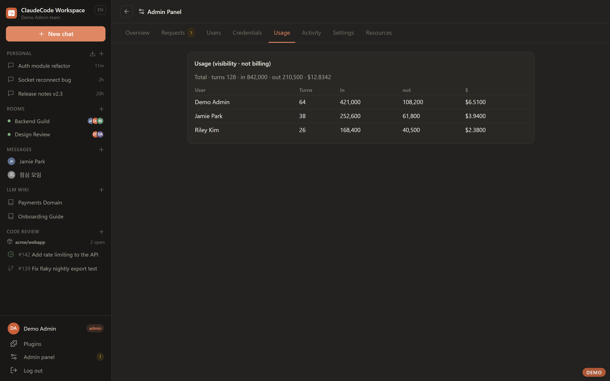
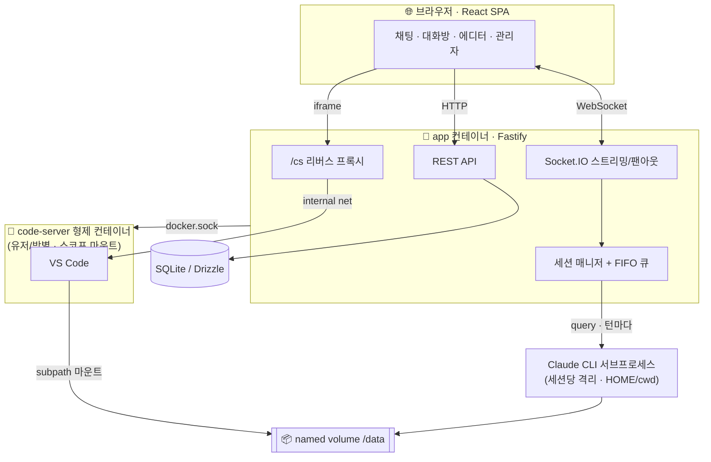

<div align="center">

[English](README.md) · **한국어**


# ClaudeCode Workspace

**서버 1대에 상주하는 Claude Code를, 팀 전체가 웹에서 함께 쓰는 워크스페이스.**

세션마다 격리된 Claude Code · 여러 명이 같이 쓰는 공유 대화방 · 브라우저 안의 VS Code까지 — 한 번의 `docker compose up`으로.

[](https://scian0204.github.io/ClaudeCodeWorkspace/)


<br/>


<sub>로그인 → 대화방 → 메시지 전송 → 웹에서 툴 승인 → 툴 실행 → 분할 뷰로 브라우저 속 VS Code까지 (MOCK 모드 데모)</sub>

<br/><br/>

**▶ [라이브 데모 보기](https://scian0204.github.io/ClaudeCodeWorkspace/)** — 설치도 로그인도 필요 없습니다. 백엔드만 목(mock)으로 바꾼 실제 UI라 스트리밍·툴카드·웹 권한 승인·대화방·LLM Wiki·관리자 패널까지 그대로 눌러볼 수 있습니다. 새로고침하면 데이터는 초기화됩니다.

</div>

---

## 목차

- [한눈에](#한눈에)
- [📸 기능 둘러보기](#-기능-둘러보기)
- [✨ 강점](#-강점)
- [🚀 빠른 시작](#-빠른-시작)
- [🧭 아키텍처](#-아키텍처)
- [🧩 기능 자세히](#-기능-자세히)
- [⚙️ 설정 (.env)](#️-설정-env)
- [🗂 구조](#-구조)
- [🔐 보안 posture](#-보안-posture)
- [🛣 로드맵](#-로드맵)
- [🤝 기여 · 라이선스](#-기여--라이선스)

---

## 한눈에

Claude Code CLI는 강력하지만 **내 터미널 하나**에 묶여 있습니다. ClaudeCode Workspace는 그 CLI를 **서버에 올려 팀 자산으로** 바꿉니다.

- 각자 브라우저로 접속 → **자기만의 격리된 Claude Code 세션**
- 필요하면 **단체 대화방**에 모여 하나의 Claude를 같이 부린다 (단톡방처럼)
- **동료에게 DM을 보내거나 그룹 채팅방을 만든다** — 클로드 없는 순수 사람 간 텍스트, 관리자는 그룹을 공통 프로젝트 방으로 승격 가능
- 승인이 필요한 위험한 작업은 **웹에서 실시간 승인/거부**
- 그 자리에서 **VS Code(code-server)** 를 열어 편집·터미널·git까지
- 클론한 저장소를 채팅 헤더에서 **커밋 & 푸시** (Claude가 대신 해줄 수도) — 암호화된 유저별 git 자격증명 사용
- 문서를 올리면 Claude가 컴파일해 주는 **LLM Wiki** 팀 지식 기반
- **로컬 세션 가져오기** — 프로젝트 폴더와 `~/.claude` 세션 파일을 업로드해 대화를 resume 가능한 개인 세션으로 복제
- **자동 PR 리뷰** — 열린 PR마다 파이프라인 자동 실행(머지→빌드/실행→버그·코드리뷰→병합 가능 판단), 한 번 클릭으로 원격 병합
- **채팅 헤더의 실시간 사용량 미터** — 세션별 **컨텍스트 윈도우** 사용률 + 내 **claude.ai 플랜 한도**(5시간·주간·모델별)를 재설정 카운트다운과 함께 CLI에서 바로 표시
- **세션별 모델 Effort** — 헤더 pill에서 추론 강도(낮음→최대)를 선택; 미지원 모델은 자동으로 낮은 단계로 조정
- **유저별 Claude 토큰**으로 각자 실행(관리자 공통 토큰·env 폴백), 관리자는 **사용량 대시보드**로 전체 파악
- **모바일 지원** — 반응형 레이아웃: 사이드바가 슬라이드 드로어로 접히고 대화가 전체 폭으로 표시(PWA 설치 가능)

> 개인 원격 셋업으로도 그대로 동작합니다 — 혼자라면 계정 1개짜리 "원격 Claude Code"가 됩니다.

---

## 📸 기능 둘러보기

<sub>아래 이미지는 모두 [라이브 데모](https://scian0204.github.io/ClaudeCodeWorkspace/)(MOCK 모드)에서 캡처한 **실제 UI**입니다 — 위 배지를 눌러 직접 눌러볼 수 있습니다.</sub>

### 💬 Claude와 대화 — 세션별 · 스트리밍 · 툴 카드


모든 유저가 **각자 격리된 Claude Code 세션**(별도 CLI 서브프로세스)을 가집니다. 답변은 serif 트랜스크립트에 토큰 단위로 스트리밍되고, 각 툴 호출은 **접이식 카드**(명령 + 출력)로 표시되며, `/clear`·`/compact` 마다 그 위 대화가 **타임스탬프 토글로 접혀** 스크롤이 무한정 늘어나지 않습니다.

### 🛡 웹 권한 승인 — 브라우저에서 툴 실행을 즉시 허용


Claude는 위험한 툴을 쓰기 직전 멈추고 브라우저에 물어봅니다: **허용 / 거부 / 항상 허용**. 격리 차단막(타 유저 경로·`~/.claude`·핵심 경로)은 권한 모드와 무관하게 항상 적용됩니다.

### 📊 실시간 사용량 · ⚡ 세션별 Effort · 🎛 모델 & 모드

<table>
<tr>
<td width="50%"></td>
<td width="50%"></td>
</tr>
<tr>
<td valign="top">채팅 헤더의 <b>사용량 미터</b> — 세션별 <b>컨텍스트 윈도우</b> 사용률과 <b>claude.ai 플랜 제한</b>(5시간·주간·모델별)을 리셋 카운트다운과 함께 CLI에서 그대로 표시. 헤더 pill로 <b>모델</b>·<b>추론 Effort</b>(low → max)·<b>권한 모드</b>도 전환합니다.</td>
<td valign="top"><b>슬래시 명령 팔레트</b> — <code>/</code>를 입력하면 내장·플러그인·스킬 명령(및 <code>/split</code> 같은 클라이언트 뷰 액션)이 뜹니다. 퍼지 검색되며 <code>@</code> 메뉴와 같은 느낌.</td>
</tr>
</table>

### 📎 `@` 파일 참조 · 🖇 첨부 & 붙여넣기


프로젝트 채팅에서 `@`를 입력하면 **파일·폴더**를 퍼지 검색해 `@경로` 참조를 메시지에 넣을 수 있습니다 — 컴포저를 떠나지 않고 Claude에게 파일을 지목. 아무 파일이나 첨부하거나 **클립보드 스크린샷을 붙여넣기/드래그**할 수도 있고, 이미지는 Claude에게 시각적으로 렌더링됩니다.

### 👥 공유 대화방 + 세밀한 권한 위임

<table>
<tr>
<td width="55%"></td>
<td width="45%"></td>
</tr>
</table>

**공유 대화방**에 모여 하나의 Claude를 함께 조종합니다(그룹 채팅처럼). FIFO 큐가 다자 턴을 순서대로 처리하고, 컴포저 토글이 **팀 채팅**과 **Claude 지시**를 분리합니다(`@claude`로 소환). 소유자는 **권리별로 위임**합니다: 승인 · 인터럽트 · 초대 · 강퇴 · 소유권 이전 · 방 삭제.

### 💬 DM & 그룹 채팅 — Claude 없는 순수 사람 메시징


Claude 대화방과 완전히 분리된, **모든** 유저를 위한 가벼운 메시징 레이어 — WebSocket 기반 1:1 DM과 이름 있는 그룹 채널, 안읽음 배지 포함. 관리자는 **그룹 채널을 공통 프로젝트 방으로 승격**할 수 있습니다.

### ⑂ Git 커밋 & 푸시 · 🧑‍💻 브라우저 속 VS Code

<table>
<tr>
<td width="50%"></td>
<td width="50%"></td>
</tr>
<tr>
<td valign="top">채팅 헤더에서 <b>Git 커밋 &amp; 푸시</b> — 파일 단위 스테이징, 푸시, 브랜치 전환(로컬/원격), 유저별 암호화 PAT 자격증명(관리자 공통 폴백). 어떤 자격증명·커밋 아이덴티티가 적용 중인지 정확히 보여줍니다.</td>
<td valign="top"><b>VS Code(code-server)</b>가 유저/방별 형제 컨테이너로 즉시 뜹니다 — 브라우저 속 에디터·터미널·git을 채팅과 나란히(<i>데모는 플레이스홀더; 에디터는 Docker 배포 필요</i>).</td>
</tr>
</table>

### 📚 LLM Wiki · 🔀 자동 PR 리뷰

<table>
<tr>
<td width="50%"></td>
<td width="50%"></td>
</tr>
<tr>
<td valign="top"><b>LLM Wiki</b> — 문서/이미지 폴더를 업로드하면 Claude가 질의 가능한 지식베이스로 컴파일. 모든 답변이 참고한 파일을 <b>인용 출처 패널</b>에 나열하고, 호버하면 본문 언급이 하이라이트됩니다.</td>
<td valign="top"><b>자동 PR 리뷰</b> — 각 오픈 PR이 파이프라인을 자동 실행(병합 → 샌드박스 빌드/실행 → 버그+코드 리뷰 → <b>MERGE_SAFE / DO_NOT_MERGE 판정</b>). 관리자 클릭 한 번으로 원격에서 병합.</td>
</tr>
</table>

### 👤 마이페이지 — 내 설정을 한 곳에


**프로필 이미지**, **Claude 토큰**, **LLM Provider 대체**(Bedrock / Vertex / 커스텀 base URL), **git 자격증명**, **개인 프로젝트** 관리를 모은 유저별 설정 페이지. 관리자 전용 액션(공통 프로젝트 생성, 새 위키 토픽, 관리자 권한 요청)을 **실제 기능 폼 그대로 여기서 요청**할 수 있습니다.

### 🎛 모든 것을 설정 — 관리자 패널

<table>
<tr>
<td width="33%"><br/><sub><b>개요</b> — 유저·방·세션·스로틀·공통 토큰.</sub></td>
<td width="33%"><br/><sub><b>사용량</b> — 유저별 턴·토큰·비용.</sub></td>
<td width="33%"><br/><sub><b>설정</b> — 모든 운영 노브를 실시간 편집.</sub></td>
</tr>
<tr>
<td width="33%"><br/><sub><b>리소스</b> — spawn된 컨테이너·이미지·고아 스캔 &amp; 정리.</sub></td>
<td width="33%"><br/><sub><b>활동</b> — 턴·큐·컨테이너 실시간 작업 관리자.</sub></td>
<td width="33%"><br/><sub><b>요청</b> — 멤버 요청 승인/거절.</sub></td>
</tr>
</table>

### 🔌 플러그인 · 🌐 다국어 · 📱 반응형(PWA)

<table>
<tr>
<td width="40%"></td>
<td width="40%"></td>
<td width="20%"></td>
</tr>
<tr>
<td valign="top"><b>2-클래스 플러그인</b> — 공통(관리자)·개인(유저) 티어; git·업로드 설치, 플러그인별 상세 + 원클릭 업데이트.</td>
<td valign="top"><b>다국어 UI</b> — 사이드바에서 한/영 즉시 전환, 저장 + 브라우저 언어 자동 감지.</td>
<td valign="top"><b>폰에서도 동작</b> — 사이드바가 드로어로 접히고 채팅이 전체 폭으로; PWA로 설치 가능.</td>
</tr>
</table>

---

## ✨ 강점

|  | 강점 | 설명 |
|---|---|---|
| 🧬 | **진짜 세션 격리** | "하나의 배포"지만 런타임은 세션마다 별도 프로세스. Agent SDK가 턴마다 `HOME`/`cwd`/plugins를 주입해 유저·방별로 완전히 분리 |
| 👥 | **공유 대화방 + 세밀한 위임** | 방장이 멤버별로 승인·중단·초대·추방·방장이양·방삭제 권한을 토글. FIFO 큐로 다자 대화 정렬, 발화자 프리픽스로 모델이 화자 인식. 작성창 토글로 **팀 잡담**과 **클로드 지시**를 구분(`@클로드`로 호출) — 잡담은 턴을 트리거하지 않음 |
| 🛡 | **웹 권한 프롬프트** | Claude가 툴을 쓰기 직전 멈추고 브라우저에 허용/거부/항상. 격리 deny 펜스는 모드와 무관하게 항상 적용 |
| 🧑‍💻 | **브라우저 속 VS Code** | 프로젝트를 code-server 컨테이너로 즉시 배포. 자기 볼륨 + 공통만 마운트(격리), 유휴 시 자동 회수 |
| 🔌 | **2-클래스 플러그인** | 공통(관리자)·개인(유저) 티어. git·로컬 업로드 설치, 관리자 필수강제, 유저별 on/off. 플러그인별 상세 보기 + 원클릭 업데이트 |
| 🪪 | **유저별 Claude 토큰** | 멤버가 각자 토큰 등록(암호화 저장), 사용량·비용을 개인별로 귀속. 관리자 공통 토큰 → env 순으로 폴백 |
| 🔀 | **LLM Provider 대체** | 기본 Claude 인증 토큰 대신 다른 LLM 백엔드로 턴을 실행(유저별 또는 관리자 공용, 암호화 저장). **Amazon Bedrock**·**Google Vertex AI**의 Claude 모델은 네이티브 지원, **OpenAI/ChatGPT/로컬 LLM**은 Anthropic 호환 프록시 base URL(LiteLLM·claude-code-router·Ollama shim 등)로 연결. 해석 순서: 유저 provider → 유저 토큰 → 공용 provider → 공용 토큰 → MOCK. 설정하지 않으면 기존 Claude 토큰 방식 그대로. `llmProvidersEnabled`로 게이팅 |
| 👤 | **마이페이지** | 프로필 이미지(업로드/제거, 본인 사이드바·마이페이지에 표시)·Claude 토큰·LLM Provider 대체·Git 자격증명·개인 프로젝트 관리(생성/삭제/새 대화에서 열기)를 한 페이지에 모은 유저별 설정 화면 |
| ⑂ | **Git 커밋 & 푸시** | 클론한 프로젝트를 채팅 헤더에서 바로 커밋(파일 단위 스테이징)·푸시·브랜치 전환(로컬/원격) — Claude가 직접 커밋/푸시도 가능. 클론은 전체 히스토리(모든 브랜치)를 받으며 특정 브랜치를 지정할 수 있음. GitHub/GitLab/Bitbucket용 HTTPS PAT 자격증명을 유저별로 암호화 저장(관리자 공용 폴백), 클론 시 선택, 호스트로 해석. 해당 저장소에 실제 적용되는 자격증명(내 것/공용)과 커밋 작성자를 패널에서 바로 확인 — 인증 실패 원인 파악이 쉬움 |
| 📚 | **LLM Wiki 지식 기반** | 문서/이미지 폴더를 올리면 Claude가 상호링크된 아티클로 컴파일, 유저는 읽기 전용 스레드로 질의. 이미 컴파일된 위키는 임포트로 컴파일 생략 |
| 🔀 | **자동 PR 리뷰** | 관리자가 원격지를 등록(병합권한 자격증명 필요), 서버가 GitHub/GitLab/Bitbucket을 폴링해 열린 PR마다 리뷰 세션 생성 — 관리자와 PR 작성자(읽기 전용)만 열람. 새 PR마다 **파이프라인 전자동**: 로컬 머지 → 빌드/실행 → 버그 감지·코드 리뷰 → **MERGE_SAFE / DO_NOT_MERGE 판단**. 관리자 지시 시 한 번 클릭으로 자격증명을 써서 **원격에서 PR 병합** |
| 🎛 | **모든 설정을 관리자 페이지에서** | 설정 레지스트리 한 곳에서 운영 노브 전부 — 동시 턴 캡, 모델 목록·기본값, 리뷰 파이프라인(폴 주기, 자동/코멘트 토글, 샌드박스 이미지·한도·타임아웃), code-server 이미지·유휴 시간, git 타임아웃, 세션 수명, 업로드/본문/소켓 한도 — 을 그룹별로 **실시간 편집**(대부분 즉시 적용, 일부는 *재시작 필요* 표시). env는 기본값 시드일 뿐, 인프라·시크릿은 읽기전용 표시 |
| 🧹 | **리소스 정리 (호스트 도커 포함)** | 관리자 **리소스** 탭에서 앱이 생성한 컨테이너(code-server 에디터 + 리뷰 샌드박스, 고아 감지 포함)·참조/댕글링 이미지·고아 디렉터리/DB 레코드를 스캔하고, 리소스별 정리 또는 이중 확인 **전체 초기화**로 청소. 앱이 생성한 컨테이너·댕글링 이미지·진짜 고아만 제거하고 사용자·방 프로젝트·계정·채팅 세션은 절대 건드리지 않음. `resourceCleanupEnabled`로 on/off |
| 🎛 | **활동 · 프로세스 관리** | 관리자 **활동** 탭 = 서버가 돌리는 모든 것을 보는 라이브 작업관리자: 실행 중인 Claude 턴, 대기 큐 메시지, code-server 에디터 + 리뷰 샌드박스 컨테이너, 실행 중 리뷰 파이프라인 — 각 행마다 개별 제어(인터럽트/취소/종료). 탭이 열려 있는 동안 자동 폴링(`processPollMs`) |
| 🙋 | **멤버 요청 → 관리자 승인** | 일반 유저가 관리자 전용 동작(공통 프로젝트 생성, LLM Wiki 주제 생성, 관리자 권한 요청)을 사유와 함께 요청하고, 관리자는 **요청** 탭(대기 배지 포함)에서 승인/거부. 요청은 **실제 기능 폼을 그대로 사용** — 공통 프로젝트 요청은 관리자 생성 폼과 동일하게 git clone URL·브랜치·자격증명 선택을 담고, 승인 시 실제 clone까지 수행(자격증명은 요청자 기준으로 재검증). 승인 시 서버가 동작을 실행하고 결과를 저장 — 작은 액션 레지스트리라 요청 가능한 동작 추가는 한 곳만 수정하면 됨. 권한 승격은 항상 요청자 본인만 승격되며 payload로 다른 유저를 지정할 수 없음. `approvalsEnabled`로 on/off |
| 💬 | **DM · 그룹 채팅** | 클로드 대화방과 완전히 분리된, **모든 유저**가 쓰는 가벼운 사람 간 메시지 계층 — 1:1 DM과 이름 있는 그룹 채널을 WebSocket으로 주고받고 안 읽음 배지 표시. 클로드도 큐도 없음. 같은 두 사람 간 DM은 중복 생성되지 않고, 모든 열람/전송은 서버에서 멤버십 검증. 관리자는 **그룹 채널을 (멤버 그대로) 공통 프로젝트 방으로 승격** 가능. `dmEnabled`로 on/off |
| 🔑 | **키 없이도 완전 동작** | 토큰이 어디에도 없으면 **MOCK 모드**로 스트리밍·권한·툴카드 UX가 그대로 시연됨 → 평가·데모·CI에 최적 |
| 🐳 | **한 방 배포** | 멀티스테이지 단일 이미지 + `docker compose up`. code-server는 형제 컨테이너로 동적 spawn (오케스트레이터 불필요) |
| 🗂 | **대화 히스토리 접기** | `/clear`·`/compact` 시 위쪽 대화를 타임스탬프가 붙은 토글로 접어 쌓음 — 무한 스크롤 대신 한 번의 클릭으로 과거 대화 열람 |
| 📎 | **`@` 파일·폴더 참조** | 프로젝트가 연결된 모든 채팅에서 `@` 입력 시 파일·폴더를 퍼지 검색하는 미리보기 메뉴가 뜸(`/` 명령어와 동일한 즉시 메뉴 UX). 골라 넣으면 메시지에 `@경로`가 삽입돼 컴포저를 벗어나지 않고 Claude에게 특정 파일을 가리킬 수 있음 |
| 🖇 | **파일 첨부·스크린샷 붙여넣기** | 컴포저에 아무 파일이나 첨부하거나, 클립보드 스크린샷을 그대로 붙여넣기(드래그&드롭도 가능). 업로드는 세션 워크스페이스에 대기하고 그 경로가 프롬프트에 실려 Claude가 읽음(이미지는 시각적으로 인식). 썸네일/칩이 컴포저와 대화 내역에 인라인 표시되며(**이미지 썸네일을 클릭하면 라이트박스로 전체 크기 보기**), 파일당 크기·개수 한도는 관리자 설정 가능 |
| 🎨 | **데스크톱 앱 급 UI** | Claude Code 데스크톱을 따른 clay 테마, 라이트/다크, 접이식 툴카드, serif 응답, 멤버 아바타·presence |

---

## 🚀 빠른 시작

### 개발 모드

```bash
npm install
cp .env.example .env      # 키 넣으면 실제 Claude, 비우면 MOCK 모드
npm run dev               # server :3000  +  Vite :5173 (프록시)
```

→ http://localhost:5173 접속 · 초기 관리자 **admin / admin** (배포 후 꼭 변경)

### 프로덕션 (Docker)

```bash
cp .env.example .env      # SESSION_SECRET, ANTHROPIC_API_KEY 설정
docker compose up -d --build
```

→ http://localhost:3000 · 단일 이미지가 API·WebSocket·정적 SPA·code-server 프록시를 모두 서빙

**클론·파일 불필요 — `docker run` 한 줄** (쉘 골라서 그대로 붙여넣기):

<details open><summary>Linux / macOS — bash / zsh</summary>

```bash
docker run -d --name claudecode-app \
  -p 3000:3000 \
  -v /var/run/docker.sock:/var/run/docker.sock \
  -v claudecode-workspace_data:/data \
  -e SESSION_SECRET=$(openssl rand -hex 32) \
  -e ANTHROPIC_API_KEY=sk-ant-... \
  -e CODE_SERVER_NETWORK=claudecode_internal \
  -e DATA_VOLUME=claudecode-workspace_data \
  cian0204/claudecode-workspace:latest
```
</details>

<details><summary>Windows — PowerShell</summary>

```powershell
docker run -d --name claudecode-app `
  -p 3000:3000 `
  -v /var/run/docker.sock:/var/run/docker.sock `
  -v claudecode-workspace_data:/data `
  -e SESSION_SECRET=$([guid]::NewGuid().Guid + [guid]::NewGuid().Guid) `
  -e ANTHROPIC_API_KEY=sk-ant-... `
  -e CODE_SERVER_NETWORK=claudecode_internal `
  -e DATA_VOLUME=claudecode-workspace_data `
  cian0204/claudecode-workspace:latest
```
</details>

<details><summary>Windows — CMD</summary>

```bat
docker run -d --name claudecode-app ^
  -p 3000:3000 ^
  -v /var/run/docker.sock:/var/run/docker.sock ^
  -v claudecode-workspace_data:/data ^
  -e SESSION_SECRET=replace-with-a-long-random-string ^
  -e ANTHROPIC_API_KEY=sk-ant-... ^
  -e CODE_SERVER_NETWORK=claudecode_internal ^
  -e DATA_VOLUME=claudecode-workspace_data ^
  cian0204/claudecode-workspace:latest
```
</details>

→ http://localhost:3000 · 초기 관리자 **admin / admin**. 앱이 부팅 시 `claudecode_internal` 네트워크를 자동 생성함(브라우저 VS Code용). 편집기 없이 쓸 거면 마지막 두 `-e` 줄 제거. 버전 고정은 `:latest` 대신 `:1.1.0`.

compose 파일이 편하면? build 없는 [`docker-compose.hub.yml`](docker-compose.hub.yml)도 배포돼 있음 — `curl -O` 후 `docker compose -f docker-compose.hub.yml up -d`.

> **요구사항:** code-server 편집기는 Docker 배포에서만 동작하며, 볼륨 subpath 마운트를 위해 **Docker Engine ≥ 26**이 필요합니다.

### 완전 로컬 — 데이터가 밖으로 안 나감

세션마다 Claude Code CLI를 서브프로세스로 돌리므로 **`ANTHROPIC_BASE_URL`**을 그대로 따름. 내장 **LLM Provider → `custom`** 설정(마이페이지=유저별, 관리자 패널=공용)을 로컬 Anthropic-호환 게이트웨이로 지정하면 *`api.anthropic.com`으로 요청이 아예 안 나감*:

**Ollama**(≥ 0.14)·**vLLM**·**LM Studio**·**llama.cpp**는 이제 *네이티브* Anthropic `/v1/messages` 엔드포인트를 제공 → Claude Code가 **프록시 없이 직결**. 최소 스택 = 모델 런타임 + 앱:

```yaml
# docker-compose.local.yml  ·  docker compose -f docker-compose.local.yml up -d
services:
  ollama:            # 네이티브 Anthropic 엔드포인트 — up 후: docker compose -f docker-compose.local.yml exec ollama ollama pull qwen3-coder
    image: ollama/ollama
    volumes: [ollama:/root/.ollama]
    networks: [internal]

  app:
    image: cian0204/claudecode-workspace:latest
    pull_policy: always
    ports: ["3000:3000"]
    volumes:
      - /var/run/docker.sock:/var/run/docker.sock
      - data:/data
    environment:
      SESSION_SECRET: change-me-to-a-long-random-string
      CODE_SERVER_NETWORK: claudecode_internal
      DATA_VOLUME: claudecode-workspace_data
    networks: [internal]

networks: { internal: { name: claudecode_internal } }
volumes: { data: { name: claudecode-workspace_data }, ollama: {} }
```

<details><summary>그냥 <code>docker run</code>으로?</summary>

```bash
docker network create claudecode_internal
docker run -d --name ollama --network claudecode_internal -v ollama:/root/.ollama ollama/ollama
docker exec ollama ollama pull qwen3-coder
docker run -d --name claudecode-app --network claudecode_internal \
  -p 3000:3000 \
  -v /var/run/docker.sock:/var/run/docker.sock \
  -v claudecode-workspace_data:/data \
  -e SESSION_SECRET=$(openssl rand -hex 32) \
  -e CODE_SERVER_NETWORK=claudecode_internal \
  -e DATA_VOLUME=claudecode-workspace_data \
  cian0204/claudecode-workspace:latest
```
</details>

그다음 **앱에서** → **LLM Provider → 타입 `custom`**, base URL `http://ollama:11434`, auth token `ollama`(아무 값), model = 받은 모델명(예: `qwen3-coder`). `ANTHROPIC_API_KEY` 불필요 — provider 설정이 대신함. **LiteLLM** 같은 프록시는 네이티브 Anthropic 엔드포인트가 *없는* 백엔드(순수 OpenAI-only 서버)거나 여러 provider로 라우팅할 때만 필요.

앱 + `codercom/code-server` 이미지를 최초 1회 pre-pull 하면 전체 스택 — 앱·데이터·편집기·**추론**까지 오프라인 동작. 앱 상태(세션·대화방·업로드·SQLite)는 항상 data 볼륨에 로컬 저장. 기본값에선 LLM 호출만 외부이며, 위 단계로 그것도 없앰.

### 권장 사양

동시 세션 수와 열린 편집기 수에 따라 리소스 사용량이 늘어남(code-server는 각각 형제 컨테이너). 아래 수치는 **앱/워크스페이스 자체** 기준 — 로컬 LLM(위)은 별도의 GPU/VRAM가 추가로 필요.

| | 최소 | 권장 |
|---|---|---|
| CPU | 2코어 | 4코어 이상 |
| RAM | 2 GB | 4–8 GB (편집기 1개당 약 256–512 MB) |
| 디스크 | 5 GB SSD | 20 GB+ SSD (데이터 볼륨은 프로젝트 따라 증가) |
| OS · Docker | Linux · Docker Engine ≥ 26 | Linux · Docker Engine ≥ 26 |
| 아키텍처 | amd64 또는 arm64 (멀티아치 이미지) | — |
| 네트워크 | `api.anthropic.com` 아웃바운드 HTTPS | 로컬 LLM 쓰면 **불필요**(위 참조) |

> **로컬 모델** 구동은 위 표와 별개 비용 — GPU/VRAM/RAM는 고른 모델에 전적으로 달림(7–8B 모델이면 VRAM 약 8–16 GB, 더 크면 그 이상).

### HTTPS로 PWA 설치

브라우저는 **보안 컨텍스트**에서만 **앱으로 설치**(PWA)를 허용합니다. `http://localhost`는 예외라 로컬에선 되지만, `http://<서버-IP>:3000`에서는 설치 버튼이 뜨지 않습니다. 실제 서버에서 설치하려면 **브라우저가 신뢰하는** 인증서로 HTTPS를 서빙해야 합니다 (자체 서명 인증서를 경고 무시로 통과시키는 것만으로는 부족 — Chrome이 여전히 차단):

```bash
# 서버에서 — 호스트 IP/도메인용 로컬 신뢰 인증서 생성
mkcert -install                                   # 최초 1회: 접속하는 각 기기에도 로컬 CA 신뢰 등록
mkcert -key-file certs/key.pem -cert-file certs/cert.pem 192.168.1.50 myhost.local

# 앱에 인증서 경로를 지정하고 재배포
TLS_KEY=/certs/key.pem TLS_CERT=/certs/cert.pem docker compose up -d --build
```

`./certs`는 컨테이너에 읽기 전용으로 마운트됩니다. 공인 도메인이 있으면 mkcert 대신 실제 인증서(Let's Encrypt)를 쓰세요. `TLS_KEY`/`TLS_CERT`를 비우면 그대로 평문 HTTP로 동작합니다.

### Docker Hub 배포 (버저닝)

버전을 올리고 이미지를 한 번에 배포합니다. 최초 1회 `docker login` 필요.

```bash
npm run release:patch   # 버그픽스    → 1.0.0 → 1.0.1 bump, 태그, build, push
npm run release:minor   # 새 기능      → 1.1.0
npm run release         # 버전 안 올리고 현재 버전 재-push
```

`release:*`는 `npm version`(→ `package.json` bump + git 태그 `vX.Y.Z`)을 실행한 뒤 `scripts/release.mjs`가 `:X.Y.Z`(불변)·`:latest`(이동)·`:sha-<short>`(커밋 추적) 3개 태그로 build & push 합니다. **기본은 amd64**(빠름); arm64까지 올리려면 `-- --arm`(예: `npm run release:patch -- --arm`) — 에뮬 빌드라 느려서 가끔만. `node scripts/release.mjs --dry-run`으로 미리보기, `DOCKER_REPO=you/app`로 저장소 변경.

---

## 🧭 아키텍처


```mermaid
flowchart TB
  subgraph B["🌐 브라우저 · React SPA"]
    UI["채팅 · 대화방 · 에디터 · 관리자"]
  end
  subgraph A["🐳 app 컨테이너 · Fastify"]
    API["REST API"]
    WS["Socket.IO 스트리밍/팬아웃"]
    SM["세션 매니저 + FIFO 큐"]
    PX["/cs 리버스 프록시"]
  end
  SDK["Claude CLI 서브프로세스<br/>(세션당 격리 · HOME/cwd)"]
  subgraph C["🐳 code-server 형제 컨테이너<br/>(유저/방별 · 스코프 마운트)"]
    VS["VS Code"]
  end
  DB[("SQLite / Drizzle")]
  VOL[["📦 named volume /data"]]

  UI <-->|WebSocket| WS
  UI -->|HTTP| API
  UI -->|iframe| PX
  WS --> SM
  SM -->|query · 턴마다| SDK
  API --> DB
  A -->|docker.sock| C
  PX -->|internal net| VS
  SDK --> VOL
  VS -->|subpath 마운트| VOL
```

**동작 원리 (핵심 4가지)**

1. **세션 = 서브프로세스** — Agent SDK `query()`가 세션마다 Claude CLI를 spawn. `env.HOME`으로 개인/방 설정이 자연 해석되고, 공통 플러그인·MCP·agents는 명시 주입됩니다.
2. **공유 대화방 = 장기 단일 세션** — resume로 컨텍스트를 이어가고, FIFO 큐가 여러 멤버의 발화를 순서대로 처리, 결과는 전원에게 WebSocket 팬아웃.
3. **권한 = `canUseTool` 브리지** — 콜백이 멈추면 승인권자(방장/위임자)의 웹 응답을 기다립니다. 경로 이탈 툴은 정책상 항상 차단.
4. **에디터 = 형제 컨테이너** — 앱이 도커 소켓으로 code-server를 띄우고, 자기 볼륨 subpath + 공통만 마운트한 뒤 인앱 프록시로만 노출(포트 미개방).

---

## 🧩 기능 자세히

<details>
<summary><b>공유 대화방 & 권한 위임</b></summary>

- 방 = 워크스페이스 엔티티(자체 `HOME`·프로젝트), 개인 세션과 평행 구조
- 방장 기본 승인권 → 멤버 목록에서 권한별 토글로 위임
- **위임 가능:** 승인 · 중단 · 초대 · 추방 · 방장이양 · 방삭제
- **방장 전용(위임 불가):** 방 권한모드 변경
- **잡담 vs 지시:** 작성창 토글(💬 채팅 / 🤖 클로드, 기본 채팅, 방별 기억). 채팅은 broadcast만; `@클로드` 입력 시 지시 모드로 전환; '잡담 포함' 체크 시 최근 팀 잡담을 맥락으로 전달
- 대기 중 메시지 취소, 실행 중 턴 인터럽트, presence 표시
</details>

<details>
<summary><b>권한 모델 (2-클래스 오버라이드)</b></summary>

- **클래스 1 (잠금):** 타 유저 경로·`~/.claude`·키 경로 차단, `additionalDirectories` 펜스, 권한모드 천장 — 모드 무관 항상 강제
- **클래스 2 (편의):** 공통 플러그인·MCP·agents — 기본 ON, 유저가 자기 세션서 끄기/개인 것 추가 가능(이름 충돌 시 개인 우선)
- 모드: 기본(승인) · 편집 자동승인 · 전체 허용 · 플랜, 관리자가 bypass 상한 지정
</details>

<details>
<summary><b>code-server 통합</b></summary>

- on-demand spawn + 유휴 reaper(기본 30분) + 로그아웃 시 제거 + 부팅 시 고아 정리
- 라우팅 `/cs/<uid>/<projectId>/<난수토큰>` — 타인 접근 차단, code-server auth는 프록시에 위임
- 공용 API 키는 백엔드에만 → 편집기 터미널에서 키 조회 불가
</details>

<details>
<summary><b>플러그인 관리</b></summary>

- 공통 티어 = 관리자 전용(마켓플레이스 등록·git/로컬 업로드·필수강제)
- 개인 티어 = 유저 자유(마켓 추가·설치·공통 클래스2 on/off)
- 플러그인별 상세 보기(매니페스트·스킬·파일트리) + git 플러그인 원클릭 업데이트
</details>

<details>
<summary><b>유저별 Claude 토큰</b></summary>

- 유저가 개인 Claude 토큰(`sk-ant-oat…` / `sk-ant-api…`) 등록, 암호화 저장 · 미등록자에겐 로그인 시 알림
- 턴 우선순위: 유저 개인 토큰 → 관리자 공통 토큰 → env 키 → MOCK
- 공유 대화방에선 각 발화자의 턴이 그 사람 토큰으로 실행, 사용량은 개인별 집계(관리자 대시보드)
</details>

<details>
<summary><b>LLM Provider 대체 (Bedrock / Vertex / custom base URL)</b></summary>

- 런타임은 Claude CLI(Anthropic 와이어 포맷). provider 프로필(유저별 또는 관리자 공용 폴백)이 턴마다 알맞은 env를 구성 — 기본 Claude 토큰 경로 위에 얹는 **추가 오버라이드**
- **anthropic** — Claude 토큰 고정/사용(`ANTHROPIC_API_KEY` / `CLAUDE_CODE_OAUTH_TOKEN`). 토큰을 비워 저장하면 마이페이지의 Claude 토큰을 그대로 사용
- **bedrock** — 네이티브: `CLAUDE_CODE_USE_BEDROCK=1` + 리전 + 자격증명(`AWS_BEARER_TOKEN_BEDROCK`, 또는 Access Key ID/Secret(+Session Token)) + 모델 ID
- **vertex** — 네이티브(최소): `CLAUDE_CODE_USE_VERTEX=1` + 리전 + 프로젝트 ID, 자격증명은 호스트의 GCP 기본 자격증명(ADC) 사용
- **custom** — `ANTHROPIC_BASE_URL`(+ 선택 Bearer 토큰/모델). **OpenAI/ChatGPT/로컬 LLM은 이 경로**로: Anthropic↔OpenAI를 변환하는 프록시(LiteLLM·claude-code-router·Ollama Anthropic 호환 shim)를 base URL로 지정. 앱이 OpenAI 와이어 포맷을 직접 말하지는 못함
- 해석 순서: 유저 provider → 유저 Claude 토큰 → 공용 provider → 공용 Claude 토큰/env → MOCK. **provider가 없으면 기존 토큰 경로 그대로 동작(무회귀)**
- base URL·토큰·키 등 설정은 암호화 저장, API는 비밀값을 절대 반환하지 않음(설정 여부만). `llmProvidersEnabled`로 게이팅
</details>

<details>
<summary><b>LLM Wiki (팀 지식 기반)</b></summary>

- 관리자가 문서/이미지 폴더를 업로드 → Claude가 `raw/` 소스를 읽어 `wiki/` 아티클 + `_index.md`로 **자동 컴파일**(멀티모달, 이미지 전사 포함)
- **이미 컴파일된 위키 임포트:** 주제 생성 시 "이미 컴파일된 위키" 옵션 → 컴파일 생략, 완성본을 그대로 사용(주제 export 재활용)
- 사용자는 각자 **개인 스레드**에서 위키 범위 내 읽기 전용 질의, 파일 탐색기로 raw/wiki 열람
- **인용 출처 패널:** 답변이 근거로 삼은 파일을 오른쪽 패널에 정리(wiki/raw 그룹) — 출처에 마우스를 올리면 답변 본문의 해당 언급이 하이라이트(반대 방향도), 클릭하면 그 자리에서 파일 미리보기
</details>

<details>
<summary><b>자동 PR 리뷰</b></summary>

- 개인 세션 / 대화방 / LLM Wiki와 동일선상의 **관리자 전용** 기능: 원격 저장소를 (전체) 클론하고 **병합권한 있는** git 자격증명을 지정
- 서버가 호스트(GitHub / GitLab / Bitbucket Cloud)의 열린 PR을 주기(`REVIEW_POLL_MS`, 기본 60초)로 **폴링** + 수동 "지금 새로고침" — 열린 PR마다 리뷰 세션 생성
- **열람 권한:** 관리자는 전체, PR 작성자(로컬 계정과 username 매칭)는 자기 것만 **읽기 전용**. 매칭 계정 없으면 추가 열람자 없음
- **전자동 파이프라인**(대화 불필요, `REVIEW_AUTO` 기본 on): 새 PR마다 서버가 **로컬 머지**(공유 클론에서 파생한 PR별 워크트리에 `--no-ff`; 충돌이면 중단·표시)한 뒤, **무인 에이전트 턴**이 **빌드·실행**, **버그 감지**, **diff 코드 리뷰**를 하고 **`VERDICT: MERGE_SAFE` / `DO_NOT_MERGE`** + 한 줄 요약을 낸다. 판단은 세션·사이드바 배지에 표시. **PR에 새 커밋을 push**하면(다음 폴링에서 head SHA 변경 감지) 자동으로 다시 실행되고 판단이 초기화됨. 언제든 수동 재실행 가능
- **문서만 바뀐 PR은 무거운 단계 생략:** 파이프라인이 PR 변경 파일을 먼저 읽어, 전부 비소스(Markdown·텍스트·이미지·`LICENSE` 등)면 머지·빌드·실행을 통째로 건너뛰고 사유 노트와 함께 `MERGE_SAFE`로 표시. 분류 불명 파일은 소스로 간주하므로 실제 코드 PR은 항상 전체 파이프라인을 탄다
- 무인 턴은 도구를 **자동 승인**(격리된 워크트리, 클래스1 경로 펜스는 유지)해 빌드/실행이 프롬프트로 멈추지 않음
- **저장소별 빌드 이미지 지정:** PR 코드의 빌드/실행은 잠금 격리된 형제 컨테이너(도커 소켓 없음·전 권한 드롭)에서만 돈다. 이 컨테이너 이미지를 저장소마다 지정 가능 — 파이썬·러스트·Go 등 언어에 맞춰. 비워두면 전역 기본값(`REVIEW_SANDBOX_IMAGE`, 기본 `node:20-bookworm`, 관리자 패널에서 변경). 이미지에 없는 툴은 리뷰 에이전트가 컨테이너 안에서 직접 설치할 수도 있다(느림, 다언어·1회성 대응)
- **리뷰 결과를 PR에 코멘트로 게시**(`REVIEW_COMMENT`, 기본 on): 리뷰가 끝나면 판정 + 요약 + 리뷰 본문을 해당 PR의 코멘트로 게시(GitHub 이슈 코멘트 / GitLab MR 노트 / Bitbucket PR 코멘트). 새 커밋으로 재리뷰될 때마다 각자 코멘트를 남긴다. `REVIEW_COMMENT=0`이면 워크스페이스 내부에만 보관
- **지시 시 PR 허가:** 관리자가 클릭 한 번으로 병합권한 자격증명을 써서 **원격 저장소의 PR을 실제 병합**(GitHub/GitLab/Bitbucket API) — 원격을 건드리는 유일한 단계, 확인 대화로 게이팅
- **자가복구:** 리뷰 턴에는 워치독 벽시계 상한(`REVIEW_TURN_TIMEOUT_MS`, 기본 30분)이 있다. 상한에 걸리면 포기하기 전 `reviewMaxRetries`(기본 2회)까지 **자동 재시도**하므로 일시적 멈춤이 PR을 방치 상태로 만들지 않는다. 또 리뷰 진행 중 서버가 재시작되면 ⏳에 영원히 걸려있지 않고 **부팅 시 자동으로 다시 큐에 넣어** 재개한다
</details>

<details>
<summary><b>다국어 UI (한국어 / English)</b></summary>

- 사이드바 상단 토글로 즉시 전환, `localStorage` 저장 + 브라우저 언어 자동 감지
- 사전 1곳(`web/src/lib/i18n.ts`)에서 관리, 신규 UI 문자열은 항상 i18n 처리
</details>

---

## ⚙️ 설정 (.env)

| 변수 | 설명 | 기본 |
|---|---|---|
| `ANTHROPIC_API_KEY` | env 레벨 공유 폴백 토큰(유저별·관리자 공통 토큰이 우선). 어디에도 없으면 MOCK 모드 | — |
| `SESSION_SECRET` | 쿠키 서명 시크릿 (**반드시 변경**) | — |
| `MAX_CONCURRENT_TURNS` | 공용키 전역 동시 턴 캡 + 초과 큐잉 + 429 백오프 | `3` |
| `REVIEW_POLL_MS` | 감시 중인 리뷰 저장소의 열린 PR 폴링 주기 (0이면 비활성) | `60000` |
| `REVIEW_AUTO` | 새 PR마다 리뷰 파이프라인(머지→빌드/실행→리뷰→판단) 자동 실행; `0`이면 수동 트리거만 | `1` |
| `REVIEW_COMMENT` | 완료된 리뷰(판정+요약+본문)를 PR 코멘트로 게시; `0`이면 내부에만 보관 | `1` |
| `BOOTSTRAP_ADMIN_USER` / `_PASSWORD` | 최초 부팅 admin(유저 0명일 때만) | `admin` |
| `CODE_SERVER_IMAGE` | 편집기 이미지 | `codercom/code-server:latest` |
| `CODE_SERVER_IDLE_MS` | 유휴 컨테이너 회수 시간 | `1800000` |

> 위 변수들은 **기본값**일 뿐입니다. 모든 운영 설정 — 그리고 기존에 하드코딩돼 있던 다수(git/provider 타임아웃, 샌드박스 한도, 세션 수명, 재시도/백오프 등) — 은 **관리자 패널 → 설정**에서 실시간 편집할 수 있으며, DB 오버라이드로 저장돼 재시작 없이 적용됩니다. 인프라(`PORT`, `DATA_DIR`, TLS, docker 네트워크/볼륨)와 시크릿은 그곳에서 읽기전용으로만 표시되며, 변경하려면 `.env`를 수정하고 재시작하세요.

---

## 🗂 구조

```
server/                Fastify · Socket.IO · Agent SDK · SQLite/Drizzle · dockerode
  src/claude/          세션 매니저 · config 레이어링 · 권한 브리지 · 스로틀
  src/rooms/           방 매니저(위임) · FIFO 큐
  src/codeserver/      spawn/reap · /cs 프록시(http+ws)
  src/wiki/            LLM Wiki 컴파일 (raw/ 소스 → wiki/ 아티클)
  src/auth/            로그인 · 유저별/공통 Claude 토큰 해석
  src/usage/           유저별 토큰·비용 트래킹
  src/routes/          sessions · rooms · projects · plugins · wiki · admin
web/                   React · Vite · Tailwind · Radix · zustand
  src/lib/i18n.ts      ko/en 사전 + 언어 전환
DESIGN.md              확정 설계 스펙 (19개 결정)
Dockerfile · docker-compose.yml
```

---

## 🔐 보안 posture

상호 신뢰하는 팀/개인을 전제로 한 **경량 posture**입니다. 앱 로그인 + revocable 세션 쿠키로 접근을 막고, 에이전트 파일 접근은 소프트 펜스, 사람의 편집기 터미널은 컨테이너 하드 격리 + 공용키 미노출로 분리합니다. 도커 소켓 마운트는 앱에 호스트 root급 권한을 주므로, **무신뢰 멀티테넌트 SaaS 용도가 아닙니다.** 인증 어댑터 자리를 남겨 SSO/프록시 헤더로 확장 가능합니다.

> **자동 리뷰는 PR 코드를 실행합니다 — 샌드박스에서.** 자동 PR 리뷰 파이프라인은 각 PR의 빌드/실행 스크립트를 무인으로 돌립니다. Docker 배포에서는 이를 **격리 형제 컨테이너**에서 실행합니다(PR 워크트리만 마운트, **docker 소켓 미마운트**, 모든 capability drop, `no-new-privileges`, 메모리/PID 제한). 리뷰 에이전트는 호스트 셸이 차단돼 PR 빌드/테스트 코드가 앱 컨테이너·호스트에 닿지 못합니다. 잔여 리스크: 샌드박스는 **네트워크 egress**가 열려 있어(npm/pip 등 필요) 악성 PR이 네트워크로 유출을 시도할 수 있으니 감시 저장소는 신뢰 대상으로 한정하거나 `REVIEW_AUTO=0`. 샌드박스 이미지로 못 빌드하는 스택(**.NET Framework/Windows 전용** 등)은 **정적 리뷰만**(로컬 빌드 없음, verdict에 명시). Docker 배포가 아니면 호스트 실행으로 폴백(신뢰팀 posture).

---

## 🛣 로드맵

- [x] 유저별 Claude 토큰 (개인 + 관리자 공통 + env 폴백)
- [x] LLM Provider 대체 (Bedrock / Vertex 네이티브 · OpenAI/로컬은 Anthropic 호환 프록시)
- [ ] SSO / 프록시 헤더 인증 어댑터
- [ ] Postgres · Redis 승격 (멀티프로세스 스케일)
- [ ] CRDT 실시간 협업 편집

---

## 🤝 기여 · 라이선스

이슈/PR 환영합니다. 커밋은 기능 단위(`feat`/`fix`/`chore`)로 유지합니다.
[MIT License](LICENSE).

<div align="center"><sub>Built with Claude Code · 설계부터 구현·QA까지 <a href="DESIGN.md">DESIGN.md</a> 참고</sub></div>
