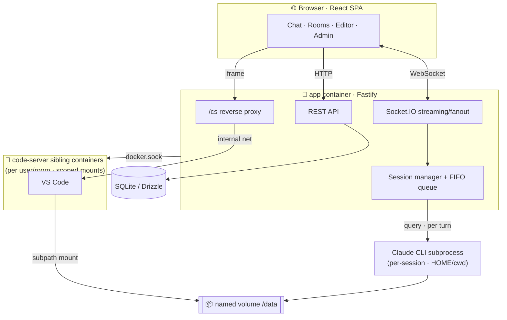

<div align="center">

**English** · [한국어](README.ko.md)


# ClaudeCode Workspace

**The server-resident Claude Code, shared by your whole team through the browser.**

Per-session isolated Claude Code · shared team rooms · VS Code in the browser — all from a single `docker compose up`.


<br/>


<sub>Log in → room → send a message → approve the tool in the browser → tool runs → split into VS Code in the browser (MOCK-mode demo)</sub>

</div>

---

## At a glance

The Claude Code CLI is powerful, but it's tied to **one terminal — yours**. ClaudeCode Workspace lifts that CLI **onto a server and turns it into a team asset**.

- Everyone connects via browser → **their own isolated Claude Code session**
- Gather in a **shared room** to drive one Claude together (like a group chat)
- Risky actions that need approval → **approve/deny live, in the browser**
- Open **VS Code (code-server)** right there for editing, terminal, and git
- Runs on a single shared API key; admins see everything via a **usage dashboard**

> Works as a personal remote setup too — solo, it becomes a single-account "remote Claude Code".

---

## ✨ Strengths

|  | Strength | Description |
|---|---|---|
| 🧬 | **True session isolation** | "One deployment," but the runtime is a separate process per session. The Agent SDK injects `HOME`/`cwd`/plugins every turn, fully separating users and rooms. |
| 👥 | **Shared rooms + fine-grained delegation** | The owner toggles per-member rights: approve, interrupt, invite, kick, transfer ownership, delete room. A FIFO queue orders multi-party turns; speaker prefixes let the model track who's talking. |
| 🛡 | **Web permission prompts** | Claude pauses right before using a tool and asks the browser: allow / deny / always. The isolation deny-fence always applies, regardless of mode. |
| 🧑‍💻 | **VS Code in the browser** | Spin up a project in a code-server container instantly. Mounts only your volume + the shared one (isolated); auto-reaped when idle. |
| 🔌 | **Two-class plugins** | Common (admin) and personal (user) tiers. Install via git or local upload, admin-forced plugins, per-user on/off. |
| 🔑 | **Fully functional without a key** | With no `ANTHROPIC_API_KEY`, it runs in **MOCK mode** — streaming, permissions, and tool-card UX all demoable. Ideal for evaluation, demos, CI. |
| 🐳 | **One-shot deploy** | Multi-stage single image + `docker compose up`. code-server spawns dynamically as sibling containers (no orchestrator needed). |
| 🎨 | **Desktop-app-grade UI** | Clay theme following the Claude Code desktop app, light/dark, collapsible tool cards, serif responses, member avatars and presence. |

---

## 🚀 Quick start

### Development

```bash
npm install
cp .env.example .env      # add a key for real Claude, leave empty for MOCK mode
npm run dev               # server :3000  +  Vite :5173 (proxy)
```

→ open http://localhost:5173 · initial admin **admin / admin** (change it after deploy)

### Production (Docker)

```bash
cp .env.example .env      # set SESSION_SECRET, ANTHROPIC_API_KEY
docker compose up -d --build
```

→ http://localhost:3000 · a single image serves the API, WebSocket, static SPA, and code-server proxy

> **Requirement:** the code-server editor works only in the Docker deployment, and needs **Docker Engine ≥ 26** for volume-subpath mounts.

---

## 🧭 Architecture



**How it works (4 keys)**

1. **Session = subprocess** — The Agent SDK `query()` spawns a Claude CLI per session. `env.HOME` resolves personal/room settings naturally; common plugins/MCP/agents are injected explicitly.
2. **Shared room = one long-lived session** — Context continues via resume; a FIFO queue processes members' turns in order; results fan out to everyone over WebSocket.
3. **Permissions = `canUseTool` bridge** — The callback blocks for the approver's (owner/delegate) web response. Path-escaping tools are always blocked by policy.
4. **Editor = sibling container** — The app launches code-server over the Docker socket, mounts only your volume subpath + the shared one, and exposes it solely through the in-app proxy (no published port).

---

## 🧩 Features in detail

<details>
<summary><b>Shared rooms & delegation</b></summary>

- Room = a workspace entity (its own `HOME`/projects), parallel to personal sessions
- Owner holds approval by default → delegate per right from the member list
- **Delegable:** approve · interrupt · invite · kick · transfer ownership · delete room
- **Owner-only (non-delegable):** changing the room's permission mode
- Cancel queued messages, interrupt a running turn, presence indicators
</details>

<details>
<summary><b>Permission model (2-class override)</b></summary>

- **Class 1 (locked):** blocks other users' paths, `~/.claude`, key paths; `additionalDirectories` fence; permission-mode ceiling — always enforced regardless of mode
- **Class 2 (convenience):** common plugins/MCP/agents — on by default; users can turn them off in their session or add personal ones (personal wins on name clash)
- Modes: default (approve) · accept-edits · bypass · plan; admin caps the bypass ceiling
</details>

<details>
<summary><b>code-server integration</b></summary>

- on-demand spawn + idle reaper (default 30 min) + removal on logout + orphan cleanup on boot
- routing `/cs/<uid>/<projectId>/<random-token>` — blocks others' access; code-server auth delegated to the proxy
- the shared API key stays backend-only → editor terminals can't read it
</details>

<details>
<summary><b>Plugin management</b></summary>

- Common tier = admin-only (register marketplaces · git/local upload · force-required)
- Personal tier = user-controlled (add marketplaces · install · toggle common class-2)
</details>

---

## ⚙️ Configuration (.env)

| Variable | Description | Default |
|---|---|---|
| `ANTHROPIC_API_KEY` | Shared single key. Empty → MOCK mode | — |
| `SESSION_SECRET` | Cookie signing secret (**must change**) | — |
| `MAX_CONCURRENT_TURNS` | Global concurrent-turn cap for the shared key + queueing + 429 backoff | `3` |
| `BOOTSTRAP_ADMIN_USER` / `_PASSWORD` | First-boot admin (only when there are zero users) | `admin` |
| `CODE_SERVER_IMAGE` | Editor image | `codercom/code-server:latest` |
| `CODE_SERVER_IDLE_MS` | Idle-container reclaim time | `1800000` |

---

## 🗂 Structure

```
server/                Fastify · Socket.IO · Agent SDK · SQLite/Drizzle · dockerode
  src/claude/          session manager · config layering · permission bridge · throttle
  src/rooms/           room manager (delegation) · FIFO queue
  src/codeserver/      spawn/reap · /cs proxy (http+ws)
  src/routes/          sessions · rooms · projects · plugins · admin
web/                   React · Vite · Tailwind · Radix · zustand
DESIGN.md              finalized design spec (19 decisions, Korean)
Dockerfile · docker-compose.yml
```

---

## 🔐 Security posture

A **lightweight posture** that assumes a mutually trusted team/individual. App login + revocable session cookies gate access; agent file access is a soft fence; a human's editor terminal is isolated behind a hard container boundary with the shared key kept out. The Docker socket mount grants the app host-root-level power, so **this is not a zero-trust multi-tenant SaaS.** An auth-adapter seam is left for SSO / proxy-header extension.

---

## 🛣 Roadmap

- [ ] Per-user API keys (behind the key-resolution abstraction)
- [ ] SSO / proxy-header auth adapter
- [ ] Postgres · Redis promotion (multi-process scale)
- [ ] CRDT real-time collaborative editing

---

## 🤝 Contributing · License

Issues and PRs welcome. Keep commits feature-scoped (`feat`/`fix`/`chore`). [MIT License](LICENSE).

<div align="center"><sub>Built with Claude Code · see <a href="DESIGN.md">DESIGN.md</a> for design → implementation → QA</sub></div>
